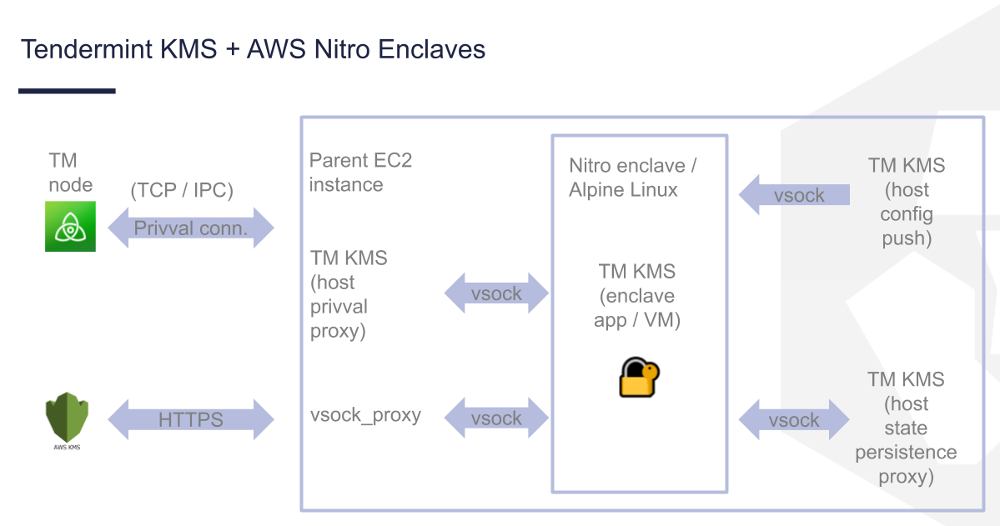
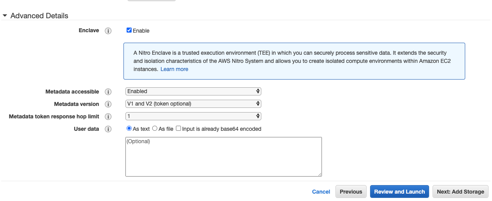
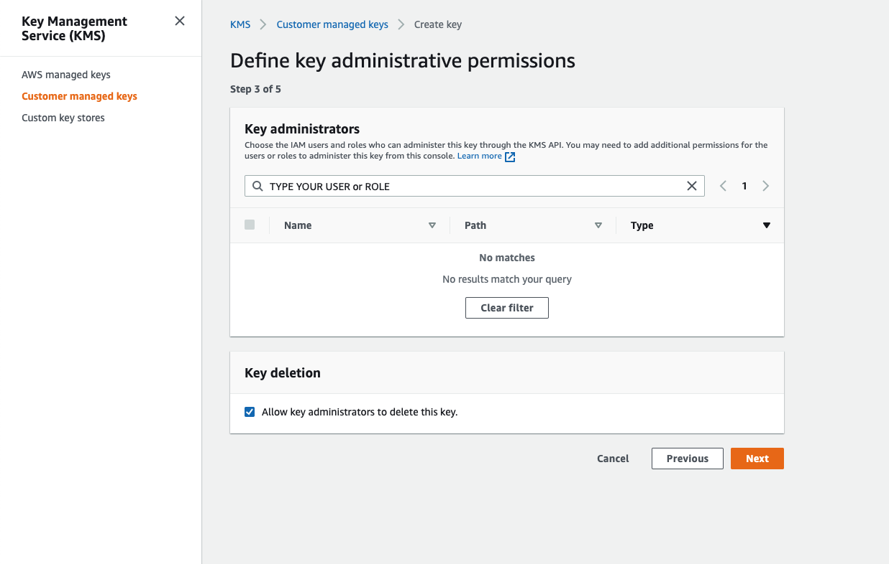

# Advanced TMKMS Integration

- The default consensus engine available within the SDK is Tendermint Core. See [Tendermint notes on running in production](https://docs.tendermint.com/master/tendermint-core/running-in-production.html) and [notes on setting up a validator](https://docs.tendermint.com/master/nodes/validators.html#setting-up-a-validator)
- Validator block signing should be via [tmkms](https://github.com/iqlusioninc/tmkms)

## Setting up AWS Nitro Enclaves + Tendermint KMS for signing blocks
::: warning CAUTION
The setup isn't yet ready for production use: 
1) It is not yet audited
2) The [tmkms prototype fork](https://github.com/tomtau/tmkms/tree/feature/nitro-enclave) isn't meant to be maintained in the long term
:::

### Background
[TMKMS](https://github.com/iqlusioninc/tmkms), initially targeting Cosmos Validators, provide **High-availability**, **Double-signing prevention** and **Hardware security module**.

Currently, TMKMS provides both **hardware signing** and **softsign**.
However, it is hard or impossible to plug your own [Hardware Security Modules(HSM)](https://github.com/iqlusioninc/tmkms#hardware-security-modules-recommended) to the major cloud providers when one wants to run it on the cloud for **hardware signing**. On the other hand, it is also insecure to use **softsign** as your generated signing key is actually in plain text on the machine.

What we want to achieve is just running TMKMS securely and provision validator conveniently on the cloud. To meet this end, we now can leverage [AWS Nitro Enclaves](https://aws.amazon.com/blogs/aws/aws-nitro-enclaves-isolated-ec2-environments-to-process-confidential-data/) to execute TMKMS and TMKMS then decrypts (during initialization) the signing via [AWS KMS](https://aws.amazon.com/kms/). Read more details [here](https://github.com/tomtau/tmkms/blob/feature/nitro-enclave/README.nitro.md)

Note that this is still work in progress and this document only describes a basic setup, so it is not yet ready for the production use. We recommend looking at other materials for additional setups, such as the [Security best practices for AWS KMS whitepaper](https://d0.awsstatic.com/whitepapers/aws-kms-best-practices.pdf).



### Step 1. Set up supported EC2 instance types
AWS Nitro Enclaves support (to name a few) the M5, C5, R5, T3, I3, A1, P3dn, z1d, and High Memory instances.
There are no additional charges on top of the cost of running supported EC2 instance types (with 4 vCPUs and above).

We recommend `m5a.xlarge` and `Amazon Linux 2 AMI` for easier installation for AWS Nitro Enclaves CLI.

- Remember to check `Enable` for Enclave in `Advanced Details` when configuring instance details.


### Step 2. Installing the Nitro Enclaves CLI
One needs to install Docker + Nitro Enclaves CLI.

Follow this [doc](https://docs.aws.amazon.com/enclaves/latest/user/nitro-enclave-cli-install.html) to proceed.
### Step 3. Prepare TMKMS Enclave images on EC2
You can either follow this [compiling-tmkms-for-aws-ne](https://github.com/tomtau/tmkms/blob/feature/nitro-enclave/README.nitro.md#compiling-tmkms-for-aws-ne) to build **TMKMS Enclave images** from scratch or simply use our published [image](https://hub.docker.com/r/cryptocom/nitro-enclave-tmkms/tags).

```bash
$ mkdir ~/.tmkms
$ nitro-cli build-enclave --docker-uri cryptocom/nitro-enclave-tmkms:latest --output-file ~/.tmkms/tmkms.eif
```
After building the enclave image, you should obtain 3 [enclave's measurements(PCRs)](https://docs.aws.amazon.com/enclaves/latest/user/set-up-attestation.html#where): PCR0 (SHA384 hash of the image), PCR1 (SHA384 hash of the OS kernel and the bootstrap process), and PCR2 (SHA384 hash of the application). Take a note of the **PCR0** value.

And also create and take a note of **PCR4** manually which is uniqure across ec2.
```bash
$ printf "PCR4: %s\n" $(INSTANCE_ID="$(curl http://169.254.169.254/latest/meta-data/instance-id -s)"; python -c"import hashlib, sys; h=hashlib.sha384(); h.update(b'\0'*48); h.update(\"$INSTANCE_ID\".encode('utf-8')); print(h.hexdigest())")
```

### Step 4. Preparing IAM instance role and AWS KMS policy
#### Step 4.1. Create an IAM role for EC2
[Create an IAM role](https://docs.aws.amazon.com/AWSEC2/latest/UserGuide/iam-roles-for-amazon-ec2.html#create-iam-role)for the created EC2 previously without permissions policies attached.
We will allow this role to decrypt with CMK inside nitro enclave in [KMS key policy](https://docs.aws.amazon.com/kms/latest/developerguide/key-policies.html) instead.

Attach this role to the previously created EC2. Check this [guide](https://docs.aws.amazon.com/AWSEC2/latest/UserGuide/iam-roles-for-amazon-ec2.html#attach-iam-role).

#### Step 4.2. Create your CMK

- Create your [symmetric CMK](https://docs.aws.amazon.com/kms/latest/developerguide/create-keys.html#create-symmetric-cmk)

- Define key administrative permissions and key usage permissions that user can admin, encrypt and decrypt the signing key in your local or a trusted machine via [AWS CLI](https://docs.aws.amazon.com/cli/latest/userguide/install-cliv2-mac.html).



- Edit key policy to allow only TMKMS inside nitro enclave to decrypt instead of entire EC2
  You should have a generated policy shown in the console.

  For the decryption action, you should add following snippet in "Statement" as:
```json
{
    "Id": "key-consolepolicy-3",
    "Version": "2012-10-17",
    "Statement": [
        ...
        {
            "Sid": "Enable decrypt from nitro enclave only",
            "Effect": "Allow",
            "Principal": {
                "AWS": "arn:aws:iam::<AWS_ACCOUNT_ID>:role/<EC2_IAM_ROLE>"
            },
            "Action": "kms:Decrypt",
            "Resource": "*",
            "Condition": {
                "StringEqualsIgnoreCase": {
                    "kms:RecipientAttestation:PCR4": "<PCR4>",
                    "kms:RecipientAttestation:PCR0": "<PCR0>"
                }
            }
       	}
    ]
}
```
  **Change `EC2_IAM_ROLE` ,`PCR0` and `PCR4` to what we just created in previous steps.**

If you plan to run the tmkms enclave in the debug mode, set the recipient attestation value to: `000000000000000000000000000000000000000000000000000000000000000000000000000000000000000000000000` (instead of the PCR0 value).

### Step 5. Prepare encrypted validator signing key on your local machine

#### Step 5.1. Install tmkms on your local or other trusted machine
Install generic tmkms with the [cargo install command](https://github.com/iqlusioninc/tmkms/blob/develop/README.md#installing-with-the-cargo-install-command)
```bash
cargo install tmkms --features=softsign
```
#### Step 5.2. Generate a new validator signing key
```bash
tmkms softsign keygen -t consensus signing.key
```
#### Step 5.3. Encrypt the validator signing key
```bash
aws kms encrypt --key-id "<AWS KMS KEY ARN>" \
--plaintext fileb://signing.key \
--query CiphertextBlob \
--output text \
--region <YOUR_KMS_REGION> > ciphertext
```
Take a note of the **encrypted validator signing key** from `ciphertext`

#### Step 5.4. Obtain the consensus / validator public key
If you plan to run the tmkms enclave without debug mode, you will not able to access to the tmkms log. Normally, you shall obtain the `consensus / validator public key` from the tmkms log. Therefore, before running the tmkms enclave, you shall obtain the consensus / validator public key in advance from the local or trusted machine where you also keep the generated `signing.key`.

```bash
curl https://raw.githubusercontent.com/crypto-com/chain-docs/master/docs/resources/obtain-tmkms-consensus-key.sh -s | bash
```
Take a note of the **consensus / validator public key** with the prefix `tcrocnclconspub....` for joining the network as a validator later.

### Step 6. Configure tmkms.toml for enclave TMKMS on EC2
The configuration file is modified from the standard one due to the fact that one cannot access host files or networking directly in NE, and must do so via "vsock" connection proxies.
```toml
[[chain]]
id = "..."
key_format = { type = "bech32", account_key_prefix = "...", consensus_key_prefix = "..." }
state_vsock_port = <vsock port for state persistence proxy>

[[providers.softsign]]
chain_ids = [...]
key_type = "consensus"
encrypted_key_b64 = "<the key encrypted with AWS KMS>"
aws_region = "<AWS region to use for KMS>"
## You can also specify AWS credentials, but if you don't, they will be obtained from IAM role on the host instance

[[validator]]
chain_id = "..."
addr = { port = <port for proxy to Tendermint "privval" connection> }
# you can also specify whether to use the secret connection (if "privval" over proxy is listening on TCP)
# in which case you'd need to bundle the identity key in the deployment Docker/enclave image
# (retrieving this from AWS KMS is a TODO item)
protocol_version = "..."
reconnect = true
```
Create `tmkms.toml` under `~/.tmkms` directory

:::details Example: tmkms.toml for testnet

```toml
# Tendermint KMS configuration file
[[chain]]
id = "testnet-croeseid-1"
key_format = { type = "bech32", account_key_prefix = "tcropub", consensus_key_prefix = "tcrocnclconspub" }
state_vsock_port = 6666

[[providers.softsign]]
chain_ids = ["testnet-croeseid-1"]
key_type = "consensus"
encrypted_key_b64 = "<encrypted validator signing key>"
aws_region = "<AWS region to use for KMS>"


## Validator configuration
[[validator]]
chain_id = "testnet-croeseid-1"
addr = { port = 5555 }
protocol_version = "v0.34"
reconnect = true
```
:::

### Step 7. Compiling tmkms for the host instance
Unless you have all the AWS C dependencies and musl ready on the host instance, you may not be able to run the tmkms binary previously compiled for the enclave image. In that case, you can compile the tmkms on the host as follows:
```bash
git clone https://github.com/tomtau/tmkms.git -b feature/nitro-enclave
cd tmkms
sudo yum install gcc gcc-c++  -y
cargo build --features=nitro-enclave,softsign --release
cp ./target/release/tmkms /usr/local/bin/
```
### Step 8. Create TMKMS enclave service
To launch the TMKMS enclave, one needs to execute several commands to make it work.
One can follow this [RUN it](https://github.com/tomtau/tmkms/blob/feature/nitro-enclave/README.nitro.md#run-it).

In order to have a resilient validator, one should run the TMKMS enclave as a service.

#### Step 8.1. Create a script to run TMKMS enclave

```bash
#!/bin/bash

set -e

TRAP_FUNC ()
{
  nitro-cli terminate-enclave --enclave-id $(nitro-cli describe-enclaves | jq -r .[0].EnclaveID) || echo "no existing enclave"
  kill -TERM $PID1
  kill -TERM $PID2
}

nitro-cli run-enclave --cpu-count 2 --memory 512 --eif-path /home/ec2-user/.tmkms/tmkms.eif # [--debug-mode]

vsock-proxy 8000 kms.ap-southeast-1.amazonaws.com 443 &
PID1=$!
echo "[vsock-proxy] Running in background ..."


sleep 1
tmkms nitro persist -p 6666 -s /home/ec2-user/.tmkms/priv_validator_state.json &
PID2=$!
echo "[tmkms nitro persist] Running in background ..."
trap TRAP_FUNC TERM INT EXIT

sleep 1
tmkms nitro push-config -p 5050 -i $(nitro-cli describe-enclaves | jq -r .[0].EnclaveCID) -c /home/ec2-user/.tmkms/tmkms.toml
echo "[tmkms nitro push-config] push config to nitro-enclave tmkms ..."

tmkms nitro proxy -p 5555 -u /home/ec2-user/sockets/validator.socket
```
One should adjust the port in the script if set differently in `tmkms.toml`

Create the script `run_nitro_enclave_tmkms.sh` with executable permissions under `~/.tmkms` directory
```bash
$ chmod +x run_nitro_enclave_tmkms.sh
```

#### Step 8.2. Create systemd service for TMKMS enclave

```toml
[Unit]
Description=Tendermint KMS
ConditionPathExists=/home/ec2-user/.tmkms/tmkms.eif
After=network.target

[Service]
Type=simple
User=ec2-user
Group=ec2-user
LimitNOFILE=1024

Restart=on-failure
RestartSec=10

WorkingDirectory=/home/ec2-user/.tmkms

# make sure log directory exists
PermissionsStartOnly=true

ExecStartPre=/bin/mkdir -p /home/ec2-user/sockets
ExecStartPre=/bin/chown ec2-user:ec2-user /home/ec2-user/sockets
ExecStart=/home/ec2-user/.tmkms/run_nitro_enclave_tmkms.sh

[Install]
WantedBy=multi-user.target
```
One should adjust the path in the systemd file if set different paths for the binary and script.

Create `/lib/systemd/system/tmkms.service` and run the service

```bash
sudo systemctl daemon-reload
sudo systemctl enable tmkms.service
sudo systemctl start tmkms.service
```

### Step 9. Running chain-maind

One should follow the same steps in [Croeseid Testnet: Running Nodes](./croeseid-testnet.md)

Except for one last thing one needs to further configure `~/.chain-maind/config/config.toml` to enable enclave tmkm to sign.

In `~/.chain-maind/config/config.toml`, `priv_validator_key_file` and `priv_validator_state_file` should be commented and uncomment `priv_validator_laddr` to value `unix://[path]` which should match the path in command `tmkms nitro proxy -p 5555 -u [path]` in [script](./advanced-tmkms-integration.md#step-8-1-create-a-script-to-run-tmkms-enclave). e.g. `unix:///home/ec2-user/sockets/validator.socket`
