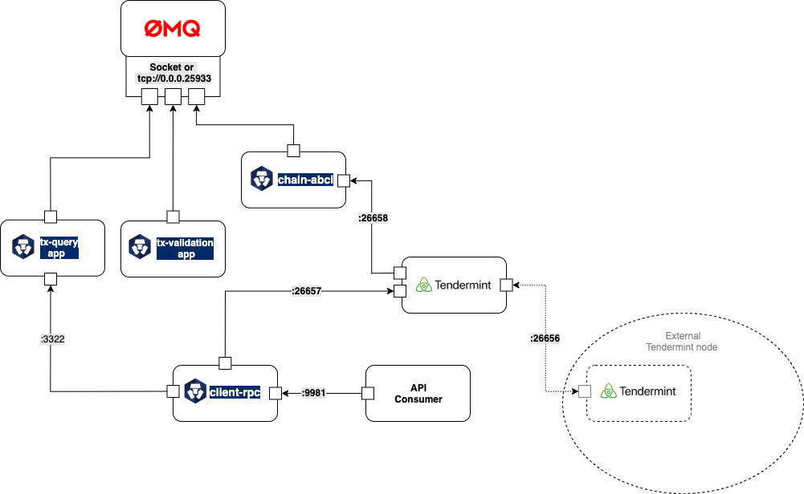
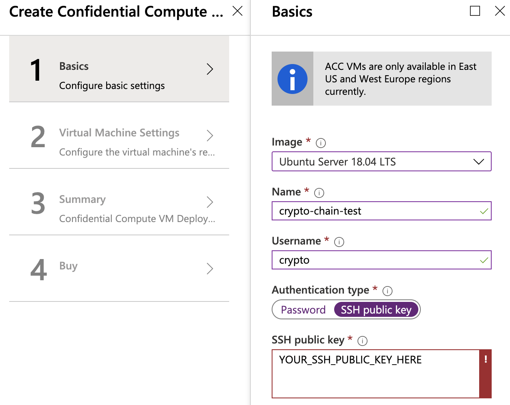
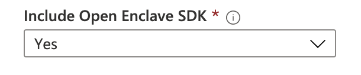
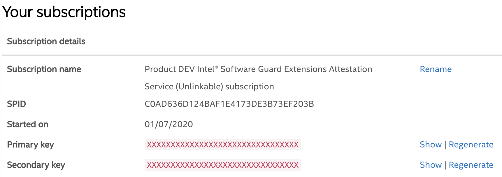

# Devnet: Running Latest Development Node

::: warning caution
this page is for building and running the latest development version of the chain for testing purpose only. development branch is under active development and is highly unstable and subject to breaking changes. you should expect a moderate amount of troubleshooting work is required.

for anyone interested in joining the crypto.com chain testnet,
please refer to our [testnet documentation](./thaler-testnet.md).
:::

By following this tutorial, you can compile and run the latest development version of Crypto.com Chain from scratch. It is intended for testing purpose only.

For the ease of environment setup, we will be using `Microsoft Azure`. With supported hardware, you can run the chain locally. However, since there are many variations in hardwares and OSs, the steps to setup may be different from this documentation and we will not cover it.

## Pre-requisites

#### Intel® Software Guard Extensions (Intel® SGX)

Because we utilize the technology of `Intel® Software Guard Extensions (Intel® SGX)`
for [payment data confidentiality](../protocol/transaction-privacy.md#motivation), the pre-requisites are a little more strict than the other
chains' setup. A special type of hardware is needed and the reference of [SGX-hardware](https://github.com/ayeks/SGX-hardware)
could help you identify if your current hardware supports `Intel® SGX` or not.

If your development machine does not support SGX, we recommend spinning up a cloud instance listed in the [this reference](https://github.com/ayeks/SGX-hardware#cloud-vendors). In this guide, we will walk through the process of setting it up on [Azure Confidential Compute VM](https://azuremarketplace.microsoft.com/en-us/marketplace/apps/microsoft-azure-compute.acc-virtual-machine-v2?tab=overview).

#### Supported OS

We officially support Linux only. Other platforms may work but there is no guarantee. We will extend our support to other platforms after we have stablized our current architecture.

## Overview

Before diving into details, we would like to introduce you the big picture of Crypto.com Chain's main components as follows:



At the end of this getting-start document, you will be running four components:

- `chain-abci` as main chain process.
- `client-rpc` as rpc server for client's interactions.
- `tendermint` for consensus.
- `tx-query-app` allows semi-trusted client querying of sealed tx payloads.

## Azure Account Creation

You will first need to create an [Microsoft Azure](https://azure.microsoft.com/) account with a `pay-as-you-go` subscription. This will require providing your credit card information to `Microsoft Azure` and you may be subject to charges when you create a virtual machine.

Please read `Microsoft Azure` free trial introduction to see if you are eligible for the free-tier.

## Create your SSH key

To access your remote Azure VM later, you will first need to create an SSH key in your local computer. You can follow the steps [here](https://docs.github.com/en/github/authenticating-to-github/generating-a-new-ssh-key-and-adding-it-to-the-ssh-agent).

## Azure VM creation

1. Log in into the portal of Azure computing
1. Create a new [Azure Confidential Compute VM](https://azuremarketplace.microsoft.com/en-us/marketplace/apps/microsoft-azure-compute.acc-virtual-machine-v2?tab=overview) with the following config.
    - **Region**: Azure Confidential Compute VM is available in a number of regions only. You can check the latest region support [here](https://azure.microsoft.com/en-gb/global-infrastructure/services/?products=virtual-machines&regions=all).
    - **Image**: `Ubuntu Server 18.04 (Gen 2)`
    - **Authentication type**: `SSH Public Key`
    - **SSH public key**: Copy the SSH key you have generated from the above step.



3. Choose your virtual machine settings
    - Make sure to enable SSH public inbound ports:



4. Click "Create" to create the VM

## VM environment setup

1. Go to your newly-created Azure VM details page and copy your newly-created Azure VM `Public IP Address`. Then SSH to your the machine and set up the environment for Crypto.com Chain.
    ```bash
    $ ssh {Azure VM Username}@{Azure VM Public IP Address}
    ## Example: ssh crypto@127.0.0.1
    ```

1. Install `Docker`: you can refer to the following document on ["How To Install and Use Docker on Ubuntu 18.04"
  ](https://www.digitalocean.com/community/tutorials/how-to-install-and-use-docker-on-ubuntu-18-04)

    Make sure you have complete the part of `Executing the Docker Command Without Sudo` by:

    ```bash
    $ sudo usermod -aG docker ${USER}
    ```

    - Install build dependencies

    ```bash
    $ sudo apt install build-essential
    ```

    - Clone the main chain repo

    ```bash
    $ git clone https://github.com/crypto-com/chain.git
    ```

## Uninstall DCAP SGX Driver

::: tip Azure VM Intel SGX driver
Starting from July 2020, Azure DCsv2 (Confidential Cloud) instance have been upgraded to use DCAP driver higher than v1.32 which is not compatible with our chain. In this step we will re-install the SGX driver with a compatible one.
:::

1. Remove existing DCAP driver. This will take 5 minutes
    ```bash
    $ cd chain
    $ make rm-dcap-sgx-driver
    ```
1. Reboot your VM
    ```bash
    $ sudo reboot
    ```
1. Your Azure VM will now restart and you will be kicked from the SSH session. Wait for 10 minutes and SSH to your VM again
    ```bash
    $ ssh {Azure VM Username}@{Azure VM Public IP Address}
    ## Example: ssh crypto@127.0.0.1
    ```
1. Install the compatible SGX driver.
    ```bash
    $ ch chain
    $ make install-isgx-driver
    ```

## Build binary and Docker images

1. Build the Crypto.com Chain binary files:
    ```bash
    $ make build
    ```

1. It will take you 20 - 30 minutes. After the build, check the binary files are compiled successfully in following directory:
    ```bash
    $ ls target/debug

    chain-abci client-rpc client-cli tx-query-app ...
    ```

1. Build the docker image with the compiled local binary files using following command:
    ```bash
    $ make image
    ```

1. Check the image is built successfully:

    ```bash
    $ docker images

    REPOSITORY              TAG                 IMAGE ID            CREATED             SIZE
    crypto-chain            develop             817f6c7c7a76        - seconds ago      940MB
    ```

## Prepare SPID & KEY

Before kicking off all the components, there is one more step to go, which is
registering your own accessing ID and KEY for Intel SGX attestation service.

:::tip Enhanced Privacy ID (EPID)
The Intel SGX attestation service is a public web service operated by Intel for client-based privacy focused usages on PCs or workstations. The primary responsibility of the Intel SGX attestation service is to verify attestation evidence submitted by relying parties. The Intel SGX attestation service utilizes Enhanced Privacy ID (EPID) provisioning, in which an Intel processor is given a unique signing key belonging to an EPID group. During attestation, the quote containing the processor’s provisioned EPID signature is validated, establishing that it was signed by a member of a valid EPID group. A commercial use license is required for any SGX application running in production mode accessing the Intel SGX attestation service.
:::

In short, you should go to [Intel® SGX Services](https://api.portal.trustedservices.intel.com)
to sign up for the ID and KEY. It won't take you more than 5 minutes.

1. Sign up/Sign in to [Intel® SGX Services](https://api.portal.trustedservices.intel.com)
2. Enroll in [Intel® SGX Attestation Service](https://api.portal.trustedservices.intel.com/EPID-attestation) by subscribing to the product ["DEV Intel® Software Guard Extensions Attestation Service (Unlinkable)"](https://api.portal.trustedservices.intel.com/Products/dev-intel-software-guard-extensions-attestation-service-unlinkable).
3. Go to [Manage Subscriptions page](https://api.portal.trustedservices.intel.com/developer), your `SPID` and `Primary key` will be shown on the portal as below:

    

    :::tip Page not found
    If you see page not found error when subscribing the Intel® SGX Attestation Service, make sure to sign in to [Intel® SGX Services](https://api.portal.trustedservices.intel.com/EPID-attestation) first.
    :::

1. After you obtained your `SPID` and `Primary key` from Intel, you should embed them to your `.profile` file as environment variables. So, make sure append the following lines in your `.profile` file by running the command:

    ```bash
    $ echo '
    export SPID={YOUR_SPID}
    export IAS_API_KEY={YOUR_PRIMARY_KEY}
    ' >> ~/.profile
    ```

1. Surely, remember to source the new `.profile` file:

    ```bash
    $ source ~/.profile
    ```

## Prepare environment to run the chain

- Prepare initial chain data and try to install Intel SGX if the SGX device is not ready.

    ```bash
    $ sudo make create-path
    $ sudo make chown-path user=$(id -u) group=$(id -g)
    $ make prepare
    ```

## Run chain components

1. Run all the components of Crypto.com Chain with following command:

    ```bash
    $ make run TX_QUERY_HOSTNAME={YOUR_VM_HOSTNAME}
    ```

    Depending on where you will run your wallet in the next step, `{YOUR_VM_HOSTNAME}` will have different values:
    | Wallet Location | `{YOUR_VM_HOSTNAME}` |
    | --- | --- |
    | In the same Azure machine | `127.0.0.1` |
    | Remote (e.g. from your computer) | Azure VM IP address |
    | Inside the node Docker network | Ignore `TX_QUERY_HOSTNAME` |

1. Then you can check if all containers are running normally:

    ```bash
    $ docker ps

    CONTAINER ID     IMAGE                           COMMAND                  CREATED STATUS   PORTS                                  NAMES
    fc51af59593b     crypto-chain:develop            "client-rpc --port=2…"   -       -        0.0.0.0:26659->26659/tcp               client-rpc
    bc586070744b     crypto-chain:develop            "chain-abci --chain_…"   -       -                                               chain-abci
    ade1db657cd8     tendermint/tendermint:v0.32.8   "/usr/bin/tendermint…"   -       -        0.0.0.0:26656-26657->26656-26657/tcp   tendermint
    800f173dccc7     crypto-chain:develop            "bash ./run_tx_query…"   -       -        0.0.0.0:26651->26651/tcp               sgx-query
    ```

1. Besides, you can check the chain-abci and Tendermint status by following commands:

    ```bash
    $ docker logs -f chain-abci
    [-T08:50:02Z INFO  chain_abci::app] received beginblock request
    [-T08:50:02Z INFO  chain_abci::app] received endblock request
    [-T08:50:02Z INFO  chain_abci::app] received commit request
    [-T08:50:03Z INFO  chain_abci::app] received beginblock request
    [-T08:50:03Z INFO  chain_abci::app] received endblock request
    [-T08:50:03Z INFO  chain_abci::app] received commit request
    ...

    $ curl 'http://localhost:26657/health'
    {
    "jsonrpc": "2.0",
    "id": "",
    "result": {}
    }
    ```

Congratulations! Crypto.com Chain is now running on your machine!

### Re-initialize the Devnet node

If you need to stop the processes and initialize a new chain

1. you should stop all service and remove docker containers by:

    ```bash
    $ make stop-all
    $ make rm-all
    ```

2. clean all the storage used by Tendermint, Crypto.com Chain by:

    ```bash
    $ make clean-data
    ```

3. you can initialize a new chain by:

    ```bash
    $ sudo make create-path
    $ sudo make chown-path user=$(id -u) group=$(id -g)
    $ make prepare
    $ make run TX_QUERY_HOSTNAME={YOUR_VM_HOSTNAME}
    ```

### Congratulations

Congratulations, now the environment to run Crypto.com Chain is all set. Let's on on and start [sending your first transaction](./send-your-first-transaction.md).
