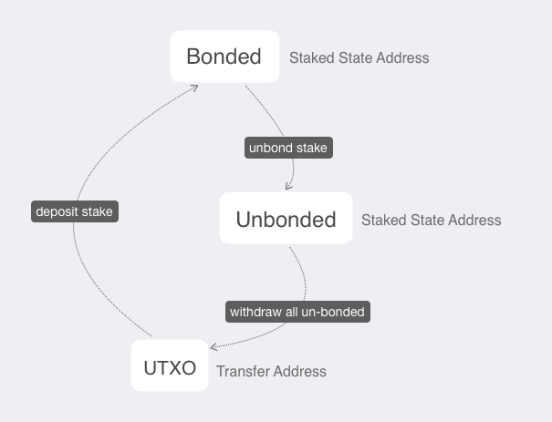

# Devnet: Send Your First Transaction

::: warning Caution
This page is a continuation of [Devnet: Running Latest Development Node](./local-devnet.md) for development.

For anyone interested more on wallet management, getting testing token from the faucet and sending transactions,
please refer to [ClientCLI](../wallets/client-cli.md).
:::

Crypto.com Chain uses a hybrid transaction accounting model with different transaction types. Before sending the transaction, please notice that the genesis fund is stored in a _staking_ address at the beginning. You first have to **withdraw** it to UTXO:



Specifically, the blockchain begins with this [genesis file](https://github.com/crypto-com/chain/blob/master/docker/config/devnet/tendermint/genesis.json), which you can [see that](https://github.com/crypto-com/chain/blob/master/docker/config/devnet/tendermint/genesis.json#L20-L22) some genesis funds have already been distributed to the address `0x2dfd...38ea8` at the beginning:
```json
"0x2dfde2178daa679508828242119dcf2114038ea8": [
  "UnbondedFromGenesis",
  "500000000000000000"
],
```

 In this documentation, we will

- Restore the wallet with the default [mnemonics](https://github.com/crypto-com/chain/blob/master/docker/config/devnet/tendermint/mnemonics.txt#L1);
- Gain access to the allocated funds in the *staking address* `0x2dfd...38ea8` and perform transactions.

### Pre-requisites:

To start using the wallet with the client-cli, we have to configure the environment with the node information:

```bash
$ export CRYPTO_CHAIN_ID=test-chain-y3m1e6-AB
$ export CRYPTO_CLIENT_TENDERMINT=ws://127.0.0.1:26657/websocket
$ export CRYPTO_GENESIS_FINGERPRINT=0F73F35EDE9EB74299F9816B0C9DE4C7ED4D284590A4CB9348CAEC38BA86893F
```

If you are running your wallet on the same Azure machine, you can use the above configuration. If you are running the wallet on your local machine, you will have to change the `ws://127.0.0.1:26657/websocket` with the Azure instance public IP address.

## Restore the Default wallet

A pre-created Hierarchical Deterministic (HD) Wallet wallet mnemonic with genesis funds inside are prepared for you in the Devnet. To gain access to the funds, kindly restore the wallet by using this [mnemonic](https://github.com/crypto-com/chain/blob/master/docker/config/devnet/tendermint/mnemonics.txt) before moving on to the next step.

- Firstly, restore the HD wallet and name it as `Default`:

  ```bash
  $ ./target/debug/client-cli wallet restore --name Default

  Enter passphrase:       # Enter your passphrase here
  Confirm passphrase:     # Confirm your passphrase
  Enter mnemonic:         ordinary mandate edit father snack mesh history identify print borrow skate unhappy cattle tiny first
  Confirm mnemonic:       ordinary mandate edit father snack mesh history identify print borrow skate unhappy cattle tiny first

  Authentication token: 3082fe4221eb21ee8714604f6f59e548356702b20a6124eae50c4404f8deb923
  ```

You will get the `Authentication token`, keep the token safe and it will be needed for all authorized commands.

## Create _Transfer_ & _Staking_ Address

Once we have a restore wallet, we are now ready to create new addresses for performing transaction: The most common address types in Crypto.com Chain are

1. _Staking_ address: For staking related operations;
2. _Transfer_ address: For token transfer.

#### Create _Staking_ addresses

- Firstly we generate **two** `Staking` type addresses with the `Default` wallet you have just restored:

  ```bash
  $ ./target/debug/client-cli address new --name Default --type Staking
  Enter authentication token:       # Input the Authentication token
  New address: 0x45c1851c2f0dc6138935857b9e23b173185fea15
  ```

- Run it another time and obtain the _staking_ address `0x2dfd...38ea8` that stores the genesis funds:

  ```bash
  $ ./target/debug/client-cli address new --name Default --type Staking
  Enter authentication token:       # Input the Authentication token
  New address: 0x2dfde2178daa679508828242119dcf2114038ea8
  ```

#### Create a _Transfer_ address

- Afterwards, you can create a `Transfer` type address in the `Default` to receive the genesis funds:

  ```bash
  $ ./target/debug/client-cli address new --name Default --type Transfer
  Enter authentication token:       # Input the Authentication token
  New address: dcro1kxl8xy6k8twhes6j972mrzurfvgms0e549z852cgqyl796jss89sadlmgd
  ```

#### Sync your wallet

- It is important to keep your wallet sync with the blockchain. This can be easily done by the `sync` command:

  ```bash
  $ ./target/debug/client-cli sync --name Default
  Enter authentication token:       # Input the Authentication token
  Synchronizing: 1951 / 1951 [=================================] 100.00 % 930.09/s
  Synchronization complete!
  ```

::: tip Note: If you encounter a fingerprint mismatched error

```bash
$ ./target/debug/client-cli sync --name Default
Enter authentication token:
Error: Verify error: genesis-fingerprint from tendermint 0F73F35EDE9EB74299F9816B0C9DE4C7ED4D284590A4CB9348CAEC38BA86893F does not match preset genesis-fingerprint DC05002AAEAB58DA40701073A76A018C9AB02C87BD89ADCB6EE7FE5B419526C8
```

Make sure you have exported the fingerprint manually

```bash
$ export CRYPTO_GENESIS_FINGERPRINT=0F73F35EDE9EB74299F9816B0C9DE4C7ED4D284590A4CB9348CAEC38BA86893F
```

:::

#### Check the genesis funds

- Once your wallet has been synced, you can check the _status_ of the _staking_ address `0x2d..38ea8` by the following command:

  ```
  $ ./target/debug/client-cli state --name Default --address 0x2dfde2178daa679508828242119dcf2114038ea8

  +-----------------+----------------------------+
  | Nonce           |                          0 |
  +-----------------+----------------------------+
  | Bonded          |                 0.00000000 |
  +-----------------+----------------------------+
  | Unbonded        |        5000000000.00000000 |
  +-----------------+----------------------------+
  | Unbonded From   | 2019-11-20 08:56:48 +00:00 |
  +-----------------+----------------------------+
  | Jailed Until    |                 Not jailed |
  +-----------------+----------------------------+
  | Punishment Type |               Not punished |
  +-----------------+----------------------------+
  | Slash Amount    |               Not punished |
  +-----------------+----------------------------+
  ```

  As in the above example, you can see that there are `5000000000 CRO` test tokens in the _staking_ address that is `Unbonded` and ready to go.

### Withdraw the genesis funds

The following is the transaction flow between _Staking_ address and _Transfer_ addresses with transaction types `Deposit`, `Withdraw`, `Deposit` and `Unbond`.

```bash
|   Staking   |       |     Transfer     |
|   address   |       |      address     |
| 0x2d..38ea8 |       |  dcro1k...dlmgd  |
¯¯¯¯¯¯¯¯¯¯¯¯¯¯¯¯¯¯¯¯¯¯¯¯¯¯¯¯¯¯¯¯¯¯¯¯¯¯¯¯¯¯¯¯
+-------------+
│             │    Withdraw
│  Unbonded   +----------------+
│   Balance   │                │
│             │                │
+------+------+                v
       ^              +--------+--------+
       │              │   Transferable  │
Unbond │              │                 |
       │              │     Balance     │
       │              +--------+--------+
+------+------+                │
│             │                │
│   Bonded    │                │
│   Balance   + <--------------+
│             │    Deposit
+-------------+
```

We will cover the `Withdraw` type type in this section. For for further details on the other transaction types, please kindly refer to the [transaction operations](../wallets/client-cli.md#transaction-operations).

#### `Withdraw` type transaction: Withdraw the unbonded funds

- We are now ready to move the genesis funds from the _staking_ address `0x2d..38ea8`. To do this, we will perform a `Withdraw` type transaction that withdraws the funds from the _staking_ address `Unbonded` balance to the transfer address `dcro1k...dlmgd` we have just created.

```bash
$ ./target/debug/client-cli transaction new --name Default --type Withdraw
Enter authentication token:       # Input the Authentication token
Enter staking address: 0x2dfde2178daa679508828242119dcf2114038ea8
Enter transfer address: dcro1kxl8xy6k8twhes6j972mrzurfvgms0e549z852cgqyl796jss89sadlmgd
Enter view keys (comma separated) (leave blank if you don't want any additional view keys in transaction):
# Leave blank because this tx is in same wallet
Transaction successfully created
```

- Then, you can `sync` and check `balance` of your wallet:

  ```bash
  $ ./target/debug/client-cli sync --name Default
  Enter authentication token:       # Input the Authentication token
  Synchronizing: 1951 / 1951 [=================================] 100.00 % 930.09/s
  Synchronization complete!
  ```

- You can now check your `balance`. Noted that the `Available` only includes the transferable balance and the bonded/unbonded amount of your _staking_ address are not included:

  ```bash
  $ ./target/debug/client-cli balance --name Default
  Enter authentication token:       # Input the Authentication token
  +-----------+---------------------+
  | Total     | 5000000000.00000000 |
  +-----------+---------------------+
  | Pending   | 0.00000000          |
  +-----------+---------------------+
  | Available | 5000000000.00000000 |
  +-----------+---------------------+
  ```

Congratulations! You have successfully withdrawn all the unbonded genesis fund and now we will be able to transfer the test tokens to the others.

## Transfer CRO to another address/wallet

To transfer token between different wallets, we can create another wallet with the name `Bob`, or whatever name you like. The wallet type could be `hd` (Hierarchical Deterministic) or `basic`:

  ```bash
  $ ./target/debug/client-cli wallet new --name Bob --type hd
  Enter passphrase:
  Confirm passphrase:
  Please store following mnemonic safely to restore your wallet later:
  Mnemonic: cabin typical scheme rather hood sunny salon mansion hazard update video drill century athlete argue human discover dish arrow soccer science ocean puppy wagon
  Authentication token: 650aca93fdb6e6eeb988026d92e796c28f0306390a49d6bfd75160ea07e6bcb6
  ```
The following is the transaction flow between the *Transfer* addresses in `Default` wallet and the wallet `Bob`, with transaction types `Transfer`:
```
│     Transfer     │                │     Transfer     │
│    address in    │                │    address in    │
│ "Default" wallet │                │   "Bob" wallet   │
¯¯¯¯¯¯¯¯¯¯¯¯¯¯¯¯¯¯¯¯¯¯¯¯¯¯¯¯¯¯¯¯¯¯¯¯¯¯¯¯¯¯¯¯¯¯¯¯¯¯¯¯¯¯¯¯¯¯¯¯¯¯¯¯¯¯¯¯¯¯¯¯¯¯¯¯¯¯
+-----------------+                 +-----------------+
│   Transferable  │     Transfer    │   Transferable  │
│                 + <=============> +                 │
│     Balance     │                 │     Balance     │
+-----------------+                 +-----------------+
```

#### The "view-key"

In Crypto.com Chain, transactions are encrypted, and it can only be viewed by the owner of the view key. It is important that in order for the receiver to spend the funds, they would need to be able to view the transaction details and obtain the corresponding UTXO data. Therefore, the receiver's view key is one of the essential components when launching a transaction.

- For example, we can use the `view-key` command to obtain the view-key of `Default` wallet and `Bob` wallet:

  ```bash
  $ ./target/debug/client-cli view-key --name Default
  Enter authentication token:       # Input the Authentication token of Default
  View Key: 02b4dabfc862b9cb9f86b8d49520023aa0cccb2ad89446577dd0fee7bc946a79a1

  $ ./target/debug/client-cli view-key --name Bob
  Enter authentication token:       # Input the Authentication token of Bob
  View Key: 03ef78b2751d43c3309b6ac68641e56528a23dc5678a201e43a7ed852511a1c276
  ```

::: tip Tip

The following 3 types of transactions: `TransferTx`, `DepositStakeTx` and `WithdrawUnbondedTx`, have some of their payloads obfuscated.
Sender could associate one or more `view-keys` onto the transactions. The view-key associated wallet could easily sync and view the transaction.

For more information, you could refer to [Transaction Accounting Model](../protocol/transaction-accounting-model).

:::
#### `Transfer` type transaction: Transferring tokens

- In `Bob` wallet, create a *Transfer* address for receiving funds: 

  ```bash
  $ ./target/debug/client-cli address new --name Bob --type Transfer
  Enter authentication token:       # Input the Authentication token of Bob
  New address: dcro135w20p56vdduzv5e4v4g2a9ucu6vw9k25aeyd7jfxuej66l4af9s7ycz35
  ```

- Then, you can transfer your tokens to Bob by:

  ```bash
  $ ./target/debug/client-cli transaction new --name Default --type Transfer

  Enter authentication token:       # Input the Authentication token of Default
  Enter output address: dcro135w20p56vdduzv5e4v4g2a9ucu6vw9k25aeyd7jfxuej66l4af9s7ycz35
  Enter amount (in CRO): 12345678   # CRO token amount you will transfer to Bob
  Enter timelock (seconds from UNIX epoch) (leave blank if output is not time locked):    # Leave blank
  More outputs? [yN]
  Enter view keys (comma separated) (leave blank if you don't want any additional view keys in transaction):
  02b4dabfc862b9cb9f86b8d49520023aa0cccb2ad89446577dd0fee7bc946a79a1,03ef78b2751d43c3309b6ac68641e56528a23dc5678a201e43a7ed852511a1c276
  Transaction successfully created!
  ```

::: tip Tip

Remember to include Bob's `view-key` here.

:::

- Lastly, you can `sync` and check `balance` of Bob's wallet:

```bash
$ ./target/debug/client-cli sync --name Bob
Enter authentication token:       # Input the Authentication token
Synchronizing: 5121 / 5121 [=================================] 100.00 % 1606.16/s
Synchronization complete!
```

Check the `balance`:

```bash
$ ./target/debug/client-cli balance --name Bob
Enter authentication token:       # Input the Authentication token of Bob
+-----------+-------------------+
| Total     | 12345678.00000000 |
+-----------+-------------------+
| Pending   | 0.00000000        |
+-----------+-------------------+
| Available | 12345678.00000000 |
+-----------+-------------------+
```

Congratulations! You've successfully transferred `12345678 CRO` to Bob.

If you are interested in contributing or joining our testnet, you can continue reading the following sections about [Joining the Thaler Testnet](./thaler-testnet.md).

## Export & Import Tx

As mentioned before, sender should add the receiver's view-key to the transaction. Because sender can't push data directly to the receiver. However, it is also possible to send / receive a payment by directly exchanging the (raw) transaction payload data. The sender (who creates the transaction) would export it, the receiver would import it and check the transaction data locally and check the transaction ID against the distributed ledger. Following explains the flow:

1. **Sender**: Get your transaction id from the history, you may need to sync before running the following command:

   ```bash
   $ ./target/debug/client-cli history --limit ? --offset ? --name <sender_wallet>
   Enter authentication token: ## Insert your authentication token ##
   +----------------+--------+--------+-----+--------------+------------+
   | Transaction ID | In/Out | Amount | Fee | Block Height | Block Time |
   +----------------+--------+--------+-----+--------------+------------+
   |<transaction_id>|........|........|.....|..............|............|
   +----------------+--------+--------+-----+--------------+------------+

   ```

1. **Sender**: Export the target transaction payload from the sender's wallet:

   ```bash
   $ ./target/debug/client-cli transaction  export --id <transaction_id>  --name <sender_wallet>
   Enter authentication token: ## Insert your authentication token ##

   ## transaction_payload_example ##
   eyJ0eCI6eyJ0eXBlIjoiVHJhbnNmZXJUcmFuc2FjdGlvbiIsImlucHV0cyI6W3siaWQiOiI3ZDk3NzVjNTcyODQ1ZjRlNzRjOGU5Y2Q1NjhkZjk4Mjk0NjQ1ODM1NDA5OGQzZDBlZjcxNzRmYmQ3NDdkMDhkIiwiaW5kZXgiOjF9XSwib3V0cHV0cyI6W3siYWRkcmVzcyI6InRjcm8xenR2MDZ6dzRtdHZ3NnhhZ25jMGdheTJkbXN5OHo5cjN4N2RwdGoycW5tdnBoNDY1YXQ5c251M2x1YSIsInZhbHVlIjoiMTAwMDAwMDAwMDAwIiwidmFsaWRfZnJvbSI6bnVsbH0seyJhZGRyZXNzIjoidGNybzFtODd5cTYwMmM2M2ZrY3p2ejZwcW5xY3JzOXZ0bnEzOHRuZjQ1a3lqMG1rdHY1ZGVkaDBxYTNmcHB2IiwidmFsdWUiOiI1OTk5ODk5OTk5OTk3ODg3IiwidmFsaWRfZnJvbSI6bnVsbH1dLCJhdHRyaWJ1dGVzIjp7ImNoYWluX2hleF9pZCI6IjQyIiwiYWxsb3dlZF92aWV3IjpbeyJ2aWV3X2tleSI6IjAzZDRkNWZiN2Q4MjJiZGUwZjYwOTgwNmU3ZTEzMDVmNTI3NjYzZmM5YWU2ZmZhMjJiNDVhMDc1NDRhOGU5OGY1YiIsImFjY2VzcyI6IkFsbERhdGEifV19fSwiYmxvY2tfaGVpZ2h0IjozMjQ2Mn0
   ```

1. **Receiver**: The transaction can be imported into receiver's wallet by

   ```bash
   $ ./target/debug/client-cli transaction import --tx <transaction_payload> --name <receiver_wallet>

   Enter authentication token: ## Insert your authentication token ##

   import amount: <transaction_amount>
   ```

1. Finally, receiver can verify this transaction by checking the transaction history:

   ```bash
   $ ./target/debug/client-cli history --limit ? --offset ? --name <receiver_wallet>
   ```
