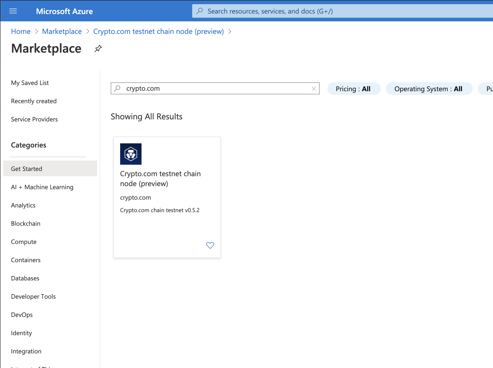
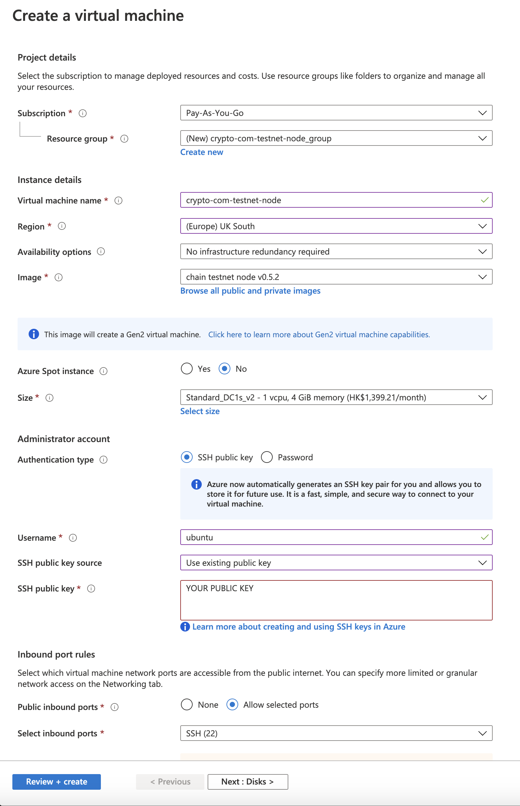
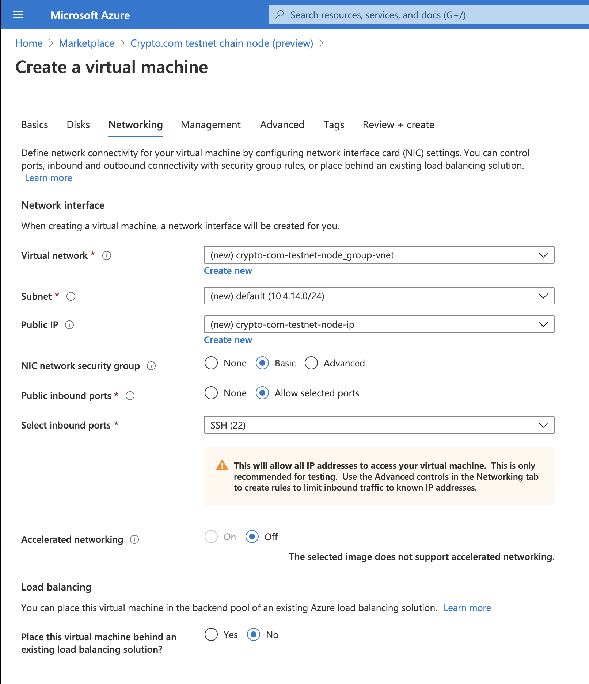

# Thaler Testnet: Running Nodes using Azure 1-click Deployment

The Crypto.com Chain Testnet has been named as **“Thaler”**.

This tutorial will use our Azure 1-click Deployment image to start and create the latest Thaler Testnet validator or full node.

## Azure Account Creation

You will first need to create an [Microsoft Azure](https://azure.microsoft.com/) account with a `pay-as-you-go` subscription. This will require providing your credit card information to `Microsoft Azure` and you may be subject to charges when you create a virtual machine.

Please read `Microsoft Azure` free trial introduction to see if you are eligible for the free-tier.

## Common Setup

### Step 1. Search for Crypto.com Chain on Marketplace

Sign in to your Microsoft Azure account and go to [Marketplace](https://portal.azure.com/#blade/Microsoft_Azure_Marketplace/MarketplaceOffersBlade/selectedMenuItemId/home). Search for "Crypto.com chain testnet node".



### Step 2. Create Crypto.com Chain

Choose the image and click "Create" to start creating the Crypto.com testnet chain node.

#### Step 2-1. Basic



| Configuration           | Value                                                                                                         |
| ----------------------- | ------------------------------------------------------------------------------------------------------------- |
| _Region_                | DCsv2-series VMs for Azure is available in three regions (East US, Canada Central and UK South)               |
| _Size_                  | Select either DC1s_v2, DC2s_v2 (Recommended) or DC4s_v2                                                        |
| _SSH public key source_ | Choose "existing public key"                                                                                  |
| _SSH public key_        | Copy and past your [SSH public key](https://docs.microsoft.com/azure/virtual-machines/linux/mac-create-ssh-keys).                                                                             |
| _Resource group_        | We suggest to create a new and dedicated one so that you can easily manage resources attached to the instance |
| _Disk_                  | **TODO**

#### Step 2-2. Disk

- Follow default setting

#### Step 2-3. Networking



- _Virtual network_, _Subnet_, _Public IP_ and _NIC_: "Create new" if you don't have any in that region

#### Step 2-4. Management

- Follow default setting
- _Boot diagnostics_: default is "On". Set to "Off" if it is not required.

#### Step 2-5. Advanced

- Follow default setting

#### Step 2-6. Tags

- Create Tag if needed

#### Step 2-7. Review + Create

- Click "create" to create your instance

### Step 3. Running a full node

Once the deployment is completed, you can connect to your instance via SSH. Afterwards, go to the `chain` directory, and you will find all the essential binaries for setting up your node:

```bash
$ cd /chain/
$ ll
total 64
drwxr-xr-x 11 root   root    4096 Aug  4 07:26 ./
drwxr-xr-x 27 root   root    4096 Aug 12 06:52 ../
drwxr-xr-x  2 crypto crypto  4096 Aug  4 06:30 .chain-abci/
drwxr-xr-x  4 crypto crypto  4096 Aug  4 06:32 .tendermint/
drwxr-xr-x  2 crypto crypto  4096 Aug  4 06:26 .tmkms/
drwxr-xr-x  2 crypto crypto  4096 Aug  4 06:28 .tx-query-enclave/
drwxr-xr-x  4 crypto crypto  4096 Aug  4 07:34 bin/
drwx------  2 root   root   16384 Aug  4 06:06 lost+found/
-rwxr-xr-x  1 crypto crypto  6400 Aug  4 07:26 reconfig.sh*
drwxr-xr-x  4 root   root    4096 Aug  4 07:07 release_binary/
drwxr-xr-x  2 crypto crypto  4096 Aug  4 06:25 sockets/
drwxr-xr-x 35 root   root    4096 Aug  4 07:06 tendermint/
```

Next, we use the reconfiguration script `reconfig.sh`, to clean up the old data(if any) and obtain a fresh validator keys. Futhermore, you can choose the node type that you would like to run:

```bash
$ ./reconfig.sh
....
....
You want to run it as a validator or a fullnode? Enter V for validator or F for fullnode:
```

To join the network as a validator, the validator public key is required. To obtain the validator public key, the following [script](https://play.golang.org/p/V24U4Kzs2Vz) by replace the field `consensusKey` with your own `consensus_key`. For example, you will see the following:

```bash
2009/11/10 23:00:00 Pubkey: AKevOEWc4p6Js0ktxlcd5Lq/58cpup+3kqGGYkGCLEc=
2009/11/10 23:00:00 Address: 7874d1718d49e31deba591c6971a8be1dd998771
```

save your `Pubkey` for later when for the `node-join` transaction. 


TODO moniker?

Tendermint and Chain-abci are running at the background. You can check their logs by the command `journalctl`, for example: 

```bash 
journalctl -u tendermint.service -f
```

### Step 4. Running a council node

TODO: SSH and run ./reconfig.sh
