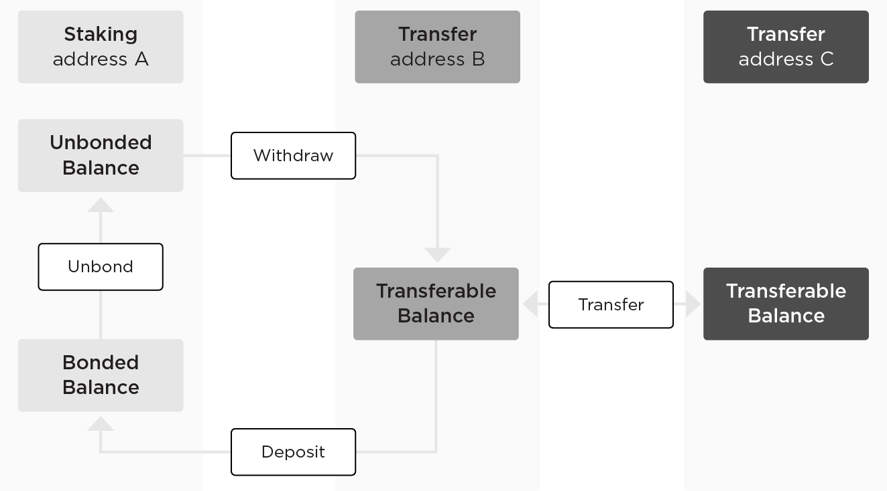

# Transaction Types and Flows


## Basic Transaction Types

To move funds around, there are four basic transaction types:

- **Transfer**: Transfer funds between _transfer addresses_;
- **Unbond**: Unbond the bonded funds in the _staking address_;
- **Withdraw**: Withdraw unbonded funds from _staking address_ to _transfer address_;
- **Deposit**: Transfer funds from _transfer address_ to _staking address_ and bond it for staking purposes.

The following diagram summarizes how different types of addresses and transactions interact with each other:


The following table shows input and output for different transaction types:
| Tx type | Inputs | Outputs | Fees involved? | Obfuscated? |
| -------------------- | ---------------------- | ---------------------------------------------------------------------------- | -------------- | ----------- |
| `TransferTx` | UTXOs | UTXOs | Yes | Yes |
| `DepositStakeTx` | UTXOs | Deposit the `bonded` amount to the specified account | Yes | Yes |
| `WithdrawUnbondedTx` | Nonce, account | UTXOs | Yes | Yes |
| `UnbondStakeTx` | Nonce, amount, account | Moves funds from `bonded` to `unbonded` under the same account with timelock | Yes | No |

:::tip Note
All these types should also contain metadata, such as [network ID](./chain-id-and-network-id.md#network-id). Furthermore, some of these transactions will be obfuscated to provide [privacy protections](./transaction-privacy.md) to the users.
:::

## Advanced Transaction Types:

Besides the above-mentioned basic transactions, there are some advanced types of transactions related to the council node and service node state metadata management, for example:

- `UnjailTx`: This transaction can be broadcasted to [un-jail](../wallets/client-cli.md#unjail-unjailing-a-validator) a node. It takes _nonce_, _account_ and has to be signed by the account’s corresponding key.
- `NodeJoinTx`: Anyone who wishes to become a council node can broadcast this transaction. It takes _council node data_, _staking address_ and has to be signed by the node's staking key. For further details on the process of joining the Crypto.com chain as a validator, please refer to this [documentation](../wallets/client-cli.md#node-join-joining-the-network-as-a-validator).

:::tip Note
There will be no transaction fee for advanced types Tx in the initial prototype.
:::

## Transaction Fees

The purpose of transaction fees in the initial prototype is an anti-spam measure, i.e. to prevent broadcasting valid transactions indefinitely.
The general scheme is:

- If the transaction type allows indefinite valid transactions in an immediate time span (e.g. `TransferTx`), a fee (calculated as below) must be paid -- i.e. each transaction should be validated that it included this sufficient fee. Note that the fee amount must be exactly equal to the computed one (this is to prevent errors where a much larger fee could be accidentally paid if the fee amount could be set arbitrarily large).
- If the transaction type allows a limited number of valid transactions, there is no fee. One example is `UnjailTx` where only one valid transaction can be sent for a given state after the unjailing period.

More details can be found in the [transactions document](../modules/transactions.md).

:::tip Notes
In the future, if necessary, a dynamic Dutch auction-style fee market may be introduced for congestion control -- this may, however, be outside of the consensus state machine, i.e. "off-chain", in order to incentivize full nodes or other network layers.

:::

#### Fee Calculation

The initial prototype uses a linear fee system. The minimal transaction fee is defined according to the formula:

```
<BASE_AMOUNT> + <PER_BYTE> * size
```

The BASE_AMOUNT (`constant`) and PER_BYTE (`coefficient`) are special [network parameters](./network-parameters.md) in a fraction of CRO. `size` is the serialized transaction data’s size in bytes.

To verify a [basic transaction](#basic-transaction-types) one would need to check:

```
sum(inputs amounts) or account.unbonded/bonded == sum(outputs amounts) + fee
```

The transaction fee goes to the [rewards pool](./reward-and-punishments.md#validator-rewards) to reward the validations.


## Transaction Identifier (TXID)

Each transaction has an identifier (typically shortened as TXID). It is defined as

| blake3_hash(SCALE-encoded transaction binary data) |
| -------------------------------------------------- |


See [serialization](./serialization.md) for more details about the transaction binary format.


## Witness

See [signature-schemes](./signature-schemes.md) for more details.

## Cross-currency transactions and settlements

A proof of concept on the cross-currency transfers and settlement on CRO can be found in this [repository](https://github.com/crypto-com/settlement-cro). It demonstrates how to configure [Interledger](https://github.com/interledger) nodes for performing CRO-ETH cross-currency transactions between the Ethereum network (testnet or mainnet) and the CRO devnet.
