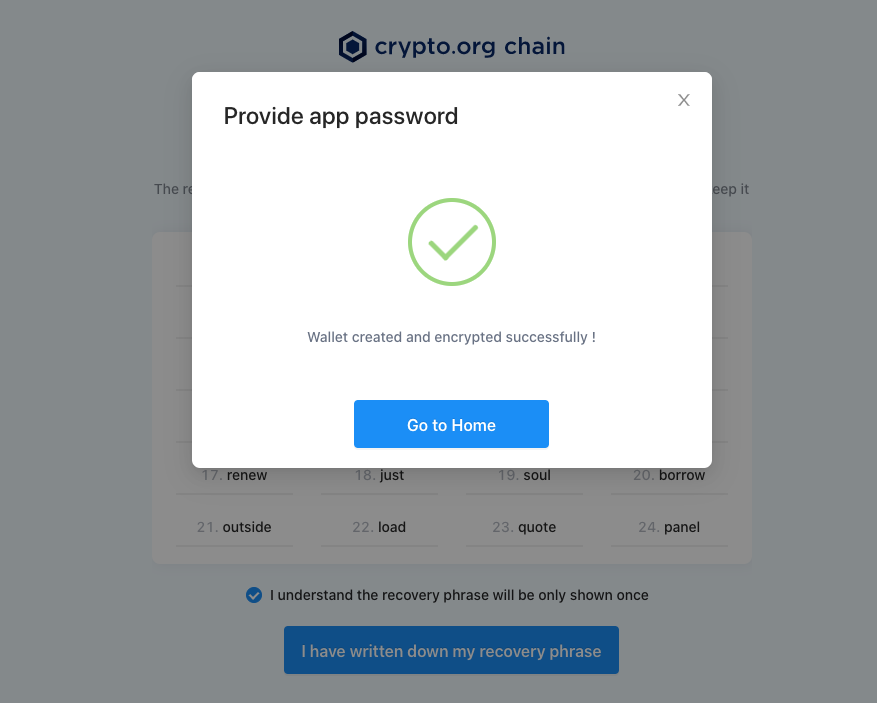
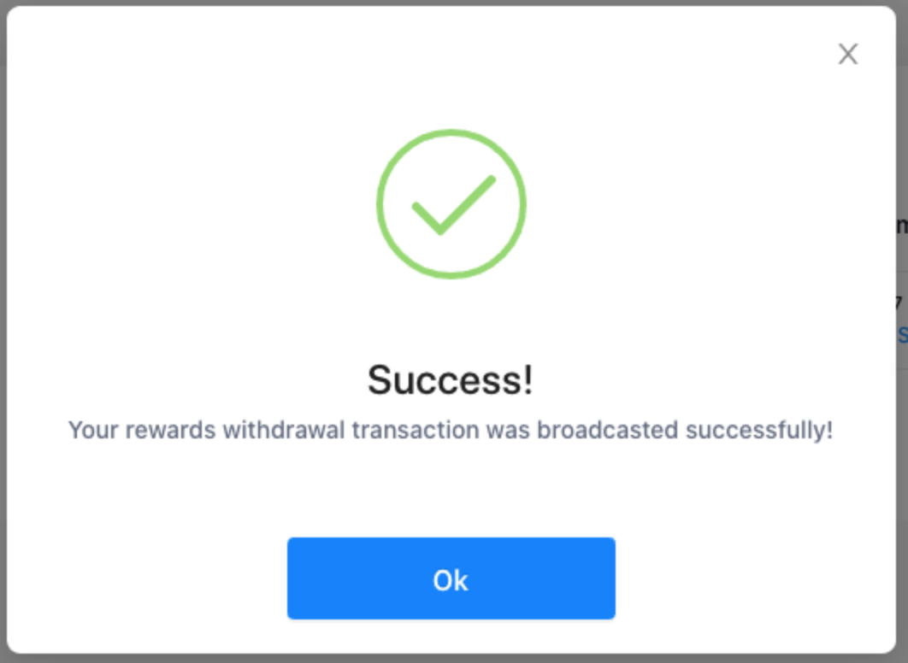
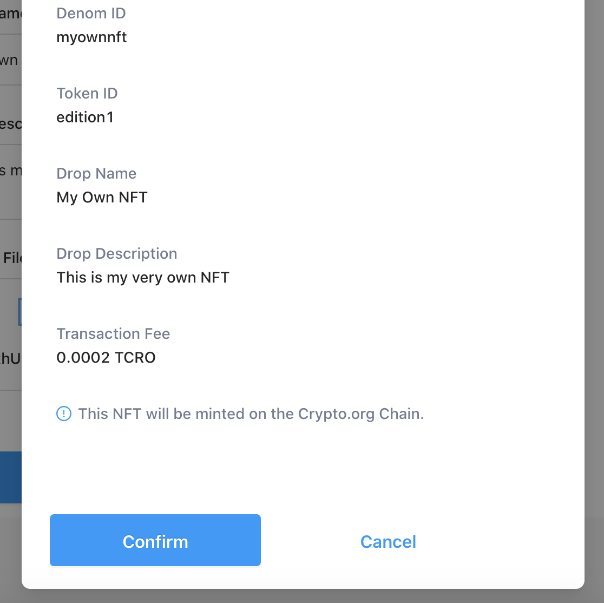

# Crypto.org Chain Desktop Wallet 

Crypto.org Chain Desktop Wallet (Beta) supports staking operations, validator selections, and governance voting. Users can also view, send and mint NFTs directly, and much more from the Desktop Wallet. The latest version can be found on the [Desktop Wallet page](https://crypto.org/desktopwallet), and the previous releases are also available on the [release page](https://github.com/crypto-com/chain-desktop-wallet/releases).

### Technical support and enquiries
In case you have any enquiry about using the Desktop Wallet, kindly send a message to the Crypto.org Chain [Discord](https://discord.gg/pahqHz26q4) #desktop-wallet channel for assistance.

## 1 Wallet Menu
This is where you could manage all your wallets, including Create, Restore, Delete, and switch between wallets.

### 1.1 - Create Wallet
Open the Desktop Wallet you just installed and conduct the following steps to create a wallet:
- **Step 1** - [Download](https://crypto.org/desktopwallet) the latest Crypto.org Chain Desktop Wallet.

- **Step 2** - Run the Crypto.org Chain Desktop Wallet and click "*Get Started*". 
        

- **Step 3** - Before creating your wallet, you would need to create an App password to protect your desktop wallet. The password is required to be at least 8 characters, containing a letter, a number, and a special character.
        
**Remark**: It is recommended to create a stronger and unguessable password. A password labeled as "*safe*" and "*strong*" means that a person would have an extremely low probability to guess it correctly.

- **Step 4** - Afterwards, your wallet is ready to be created. Please make sure you select the following options accordingly:
    - Input the wallet name of your choice.
    - For the network, three options of "*TESNET CROESEID 3*", "*MAINNET*", and "*CUSTOM DEVNET*" are given: 
        - "*TESNET CROESEID 3*" is our Cosmos-based `testnet-croeseid-3`.
        - "*MAINNET*" is referring to Crypto.org Chain mainnet. 
        - Other than these, you may fill up the custom configuration to your own network. 
    - In this demonstration, we will be creating a testnet address and connecting to the current `testnet-croeseid-3`, therefore, we select "*TESNET CROESEID 3*" as the network option.
                

- **Step 5** - After inputting the information, please hit "*Create Wallet*", and the success window will pop up. 
                

- **Step 6** - Once you click "*Continue*", the wallet will automatically generate the recovery phrase for users. Please make sure you record down all the phrases in order to restore your wallet in the future.
                

- **Step 7** - After you input the app password again, hit "*Go to Home*", and it will bring you to the main dashboard.
                

### 1.2 - Restore Wallet
When you select the option of "*Restore Wallet*", it brings you to the following window that allows you to input the wallet name and mnemonic phrase that was previously created. 
- **Step 1** - Input all the required information (make sure you input the correct information of your wallet) and then hit "*Restore Wallet*".
        

- **Step 2** - Then it requires you to input the app password you created when you initially installed the app.
        
- **Step 3** - After you input the app password, hit “Go to Home”, and it will bring you to the main dashboard. Now you have successfully restored your wallet!
        
        

### 1.3 - Delete Wallet
- **Step 1** - In the case that you would like to delete any of your wallets, you can do so by hitting the bottom left button and selecting the option "*Delete Wallet*":
        

- **Step 2** - A confirmation page will pop up with the wallet address, before deleting the wallet, please make sure you already have saved the phrase properly. If you have not backed up your wallet mnemonic phrase and deleted the wallet in the Desktop Wallet, this will result in losing your funds forever. Once you are ready to delete the wallet from the Desktop Wallet, hit "*Confirm*":
        

- **Step 3** - In the next window, please enter the words “DELETE” to further confirm, then click “Delete Wallet”. After a bit of loading time, the success page will show:
        
        

### 1.4 - Wallet List
You can find the list of all your wallets by clicking the bottom left button and selecting the "*Wallet List*", and then all the inputted wallets will be displayed on the right interface. You can select any wallet you would like to access by hitting "*Select*" under "*Action*".
        

## 2 Transactions

### 2.1 - Sending Transactions
Sending funds is easy with the Desktop Wallet. Ensure that you have enough funds before you perform the sending operation (do not forget that you can always request some testing tokens in [faucet](https://crypto.org/faucet)). In case you have reached the daily limit on faucet airdrop, you can simply send a message on [Discord #request-tcro channel](https://discord.gg/c7vSX4TSrf).

- **Step 1** - Select the "*Send*" on the left panel, fill up the request information: 
    - recipient address
    - amount to be sent 
    - optional memo
        

- **Step 2** - Once you hit the "*Continue*" button, you can review the transaction details in the confirmation window on the Desktop Wallet and proceed to the next step by clicking "*Confirm*". Then enter your app password and hit "*Decrypt Wallet*".
        

- **Step 3** - In the "*Confirm Transaction*" page, please double-check the information and make sure the information you entered is correct. Now you can go with "*Confirm*" and click "*OK*" on the next page.
        

- **Step 4** - Now your funds have been transferred successfully to your selected address! You can then check the transaction history under “Transaction” at the “Home” page.
        
        

### 2.2 - Receive Transactions
If someone is sending funds or you are sending funds from your other account to the current account, you can simply show the bar code or the address of your current account.
        

## 3 Staking Operations
Crypto.org Chain is based on Tendermint Core's consensus engine, it relies on a set of validators to participate in the proof of stake (PoS) consensus protocol who are responsible for committing new blocks in the blockchain. Token holders might stake their tokens to validators to secure the network and earn rewards. Particularly, we can:
- Delegate to a validator;
- Withdraw staking rewards from a validator;
- Undelegate from a validator.

### 3.1 - Delegate to a validator
- **Step 1** - To begin staking, please direct to "*Delegate Funds*" under the Staking option. You can choose one of the active validators that you would like to delegate to: 
        
You can input the validator’s information either by:
    - Clicking the list button under "*Validator address*", and selecting your preferred validators. 
        

    - Copying the complete address of your preferred validator, and pasting the validator’s "*Operator Address*" (begin with `tcrocncl...` for testnet) under "*Validator address*". Then specify the amount that you would like to delegate.

**Remark**: You can look up validators and their operator address by the validator list on the explorer.

- **Step 2** - Similar to sending a transaction, you can review and confirm the transaction details on the Desktop Wallet first shown below, click "*Review*" and enter your app password.
        

- **Step 3** - Now you will proceed to the confirmation page. Make sure you input the correct information of your wallet and then hit "*Confirm*". 
        
        
Now you’ve successfully staked the desired amount to your selected validator!

### 3.2 - Withdraw the reward from a validator
- **Step 1** - Under "*Staking Rewards*" on the Staking page, your staking reward amount from different validators will be displayed as below:
        
- **Step 2** - Click the "*Withdraw Reward*" under "*Action*", and input your app password. Similar to other transaction operations, you should review and double-check the transaction details "*Confirm*" before processing "*Confirm*". 
        
Please note that all of your available rewards from a validator will be withdrawn in the transaction.

Now you should see a success message on the Desktop Wallet, and your rewards withdrawal transaction was broadcasted successfully!
        

### 3.3 - Undelegate the staking from a validator
- **Step 1** - In the case that you plan to undelegate your staked funds from a validator, you can check your current delegation status at the bottom "*Delegation*" section under the "*Home*" page:
        

- **Step 2** - You can undelegate your staked tokens from a validator by clicking "*Undelegate Stake*". Afterwards, you can specify the amount of token that you would like to undelegate from a validator, review and confirm the transaction details on the Desktop Wallet, input your app password again, then click "*Confirm*" to process.
        
        

Now you should see a success message on the Desktop Wallet, and your undelegation transaction was successfully processed!

## 4 Governance
Governance proposals potentially impact many stakeholders. You are able to view all the concurrent voting, finished or rejected proposals, and cast your votes here. 
        

### 4.1 - Cast your vote to a proposal
- **Step 1** - Choose a proposal which is in its Voting Period. You’re able to see the description of this proposal, with the current ratios of different vote options. Pick your desired vote option to this proposal and then click "*Send Vote*":
        

- **Step 2** - Make sure you have reviewed and confirmed the transaction details, then click "*Confirm*"
        

## 5 NFT Support
The "*My NFT*" page is where you could manage your NFTs which exist on the Crypto.org Chain, no matter browsing around your NFTs collections, transfer any NFTs to your friend, or even mint your very own unique NFT. 
        

### 5.1 - Transfer an NFT
- **Step 1** - Under "*NFT Collection*", select the NFT you would like to transfer. Click "*Transfer NFT*":
        

- **Step 2** - Enter the Recipient Address. Please make sure that the recipient address is compatible with the Crypto.org Chain NFT token standard. Click "*Continue*":
        

- **Step 3** - Review the NFT transaction details in the confirmation window, then click "*Confirm Transfer*": 
        

### 5.2 - Mint an NFT with your own Artwork
- **Step 1** - Under "*Mint NFT*", you are required to fill up the below NFT information:
        
- **Step 2.1** - You are able to upload your Artwork as either Image(.jpg, .png), or Video (.mp4):
        
- **Step 2.2** - Do not forget to upload a Thumbnail as well if you are minting a Video NFT:
        
- **Step 3** - It will manage to upload the files directly to the IPFS network. Please wait until the file upload process finishes, then click "*Review*":
        
- **Step 4** - Review the details of the NFT. Click "*Confirm*" to approve the minting transaction:
        
        

