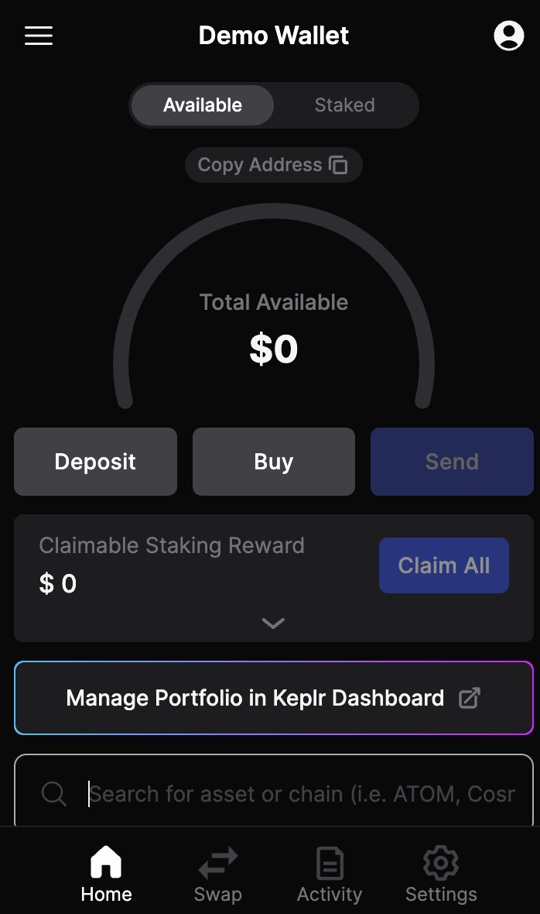

# Using Ledger Device with Keplr Wallet

Using Keplr with a Ledger Hardware device to conduct operations like staking and claiming rewards.

In the following step-by-step guide, you will learn how to stake your $CROs using the Keplr chrome extension web wallet together with your Ledger device. You may choose to use Ledger Nano S or Nano X. Ledger Nano S is used for demonstration in this tutorial.

## Install the Keplr Browser and Connect your Ledger Device

_The Keplr browser extension may request permission to access your Ledger device. Please make sure to grant this permission in your browser during this process._ \
_**Note:** the permission is strictly used to allow Keplr browser extension to communicate with the front-end servers, and all sensitive data remains local on your device._

## Setup Apps on Ledger Nano S

1. Using the Ledger LIVE app to install both Cosmos($ATOM) & Cronos POS Chain($CRO) onto your Ledger Nano S device

<figure><figcaption></figcaption></figure>

## Setup Ledger Nano S & Keplr Wallet

1. Download and install the Keplr Browser Extension from your browser’s App Store or from the [Keplr's website](https://www.keplr.app/download) or its[ release page](https://github.com/chainapsis/keplr-extension/releases).&#x20;
2. Launch the extension, then select the person icon  in the top right corner.  
3. Choose **“Add Wallet”**.  \
   .png>)
4.  In the following window, select **“Connect Hardware Wallet”.**\

    <figure><figcaption></figcaption></figure>
5.  "**Connect Ledger**"\

    <figure><figcaption></figcaption></figure>
6.  Give your Wallet a friendly username. Also make sure your Ledger Nano S is unlocked and the Cosmos app is open on the Ledger device. The Cosmos app is selected in the Keplr window by default. Click “**Next**”.\
    &#x20;\
    The “**Advanced**'' option allows users to input another HD Derivation Path for multiple accounts from the same mnemonic seed.If you have more than one account associated with the mnemonic and prefer to set up a custom account derivation path, you can set your custom HD wallet derivation path here and increase the numbers in the blank field under \[HD Derivation Path] to create a new address with the same mnemonic seed. Typically, accounts start from 0 then 1 then 2, and so on. \
    \
    Please note that by Keplr’s default setting, the coin type is 118 (Cosmos Hub) with Ledger. If you would like to recover other wallets at a later time, you may need to provide the HD path with 118 or use the Cosmos app.\
    \
    For more information about Keplr’s advanced setting, it is available [here](https://help.keplr.app/faq).\
    \
    In this tutorial, we can skip the advanced option.\

    <figure><figcaption></figcaption></figure>
7.  At this point your Ledger Nano S should be unlocked and the Cosmos app selected. Therefore click **Next** for both Step 1 & Step 2.\

    <figure><figcaption></figcaption></figure>
8.  Now select the chains you will manage with the Keplr wallet. Scroll down to select **Cronos POS**. \

    <figure><figcaption></figcaption></figure>

    <figure><figcaption></figcaption></figure>
9. If you have selected EVM compatible chains such as Injective and Evmos, quit the Cosmos app on your Ledger Nano S and open the Ethereum app if you have it installed (install the Ethereum app on your Ledger device using the Ledger LIVE app).
10. Click “**Next**” to perform the Step 1 & Step 2 here:\

    <figure><figcaption></figcaption></figure>
11. Finally your Ledger Nano S is now installed/setup on your Keplr browser wallet extension.\

    <figure><figcaption></figcaption></figure>
12. Open the Keplr browser extension by clicking on it, the click the person icon  again to see your Ledger Hardware Wallet.\
    .png>)

## Stake CRO using the Keplr Dashboard

Now we are going to use the Keplr Dashboard to Stake our **$CRO** tokens with a Validator.&#x20;

1. Open your Keplr browser extension, then click on “**Manage Portfolio in Keplr Dashboard**”.png>)
2.  The Keplr Dashboard opens in a new browser window or tab. The chains listed on the left menu of the Dashboard are chains that have been set as “**Favorites'**'. If you do not see “**Cronos POS**” in the menu then click on “**Chains**”, a list of chains will appear on the main menu in the middle of the screen.\

    <figure><figcaption></figcaption></figure>
3.  Now select **Cronos POS** from the menu. The details of your $CRO token holdings are now in the main view in the centre of the Dashboard. The “Stake” option is to the right of the screen. Go ahead and click the “**Stake**” button.\

    <figure><figcaption></figcaption></figure>
4.  A new menu appears with a list of available **Validators**, along with details of: Voting Power, API % returns & Commission. Choose the option that best fits your needs.\

    <figure><figcaption></figcaption></figure>
5.  For this demo we will select the “**Starship**” Validator. Then click the “**Stake**” button at the bottom of the screen.\

    <figure><figcaption></figcaption></figure>
6. In this scenario, we chose one of the top ten Validators. Therefore a dialog box appears encouraging us to help improve network decentralization by selecting another Validation lower down the list. For now, we will stay with our choice by clicking the button labeled “**Continue Staking**”. Then the “**Stake**” button on the next pop-up window.&#x20;
7. Next we need to “**Approve & Sign**“ the transaction by unlocking our Ledger Nano S device and opening the **Cosmos** app.\
   .png>)
8.  ..…..and that's it! We have successfully Staked our **$CRO** tokens from our Ledger Nano S hardware wallet using the Keplr browser extension wallet & **Kepler Dashboard**.\

    <figure><figcaption></figcaption></figure>

##

## Claim your Staking Rewards via the Keplr Dashboard

_Please note: claiming always incurs a transaction fee._

1.  It is ideal that you claim the staking rewards regularly. One option is to redelegate these rewards for a compound effect. To claim your **$CRO** staking rewards, open the Keplr Browser Extension and click “**Manage Portfolio in Keplr Dashboard**''. Now plug in and unlock your Ledger Nano S device, then open the **COSMOS** app.\
    Make sure you have enough $CRO to cover the transaction fee. Now click the “**Claim**” button.\

    <figure><figcaption></figcaption></figure>
2. A new window pop-up displays the details of the transaction with an “**Approve**” button at the bottom. Click “**Approve**”. The transaction details will be displayed on your Ledger Nano S device. Go ahead and “**Sign**” the transaction.\
   .png>)

You are all set! We hope this guide helps you successfully stake and claim your rewards. Now you should be familiar with all the tools and menus to manage your staking with Validators as well as claiming your rewards.\
\
For further assistance, refer to the [Keplr FAQ list or reach out to their HelpDesk](https://help.keplr.app/faq) (located at the bottom corner). You can also join [Cronos Discord](https://discord.gg/cronos) for community support and resources.
