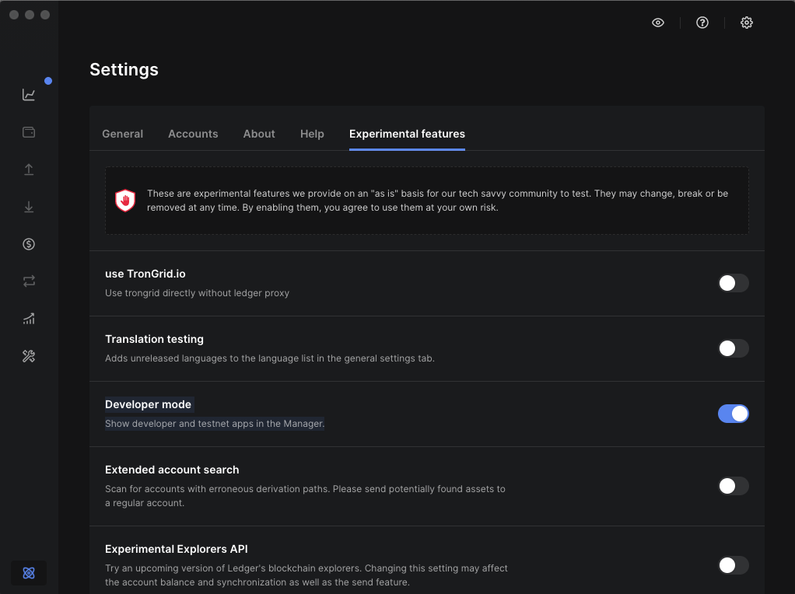
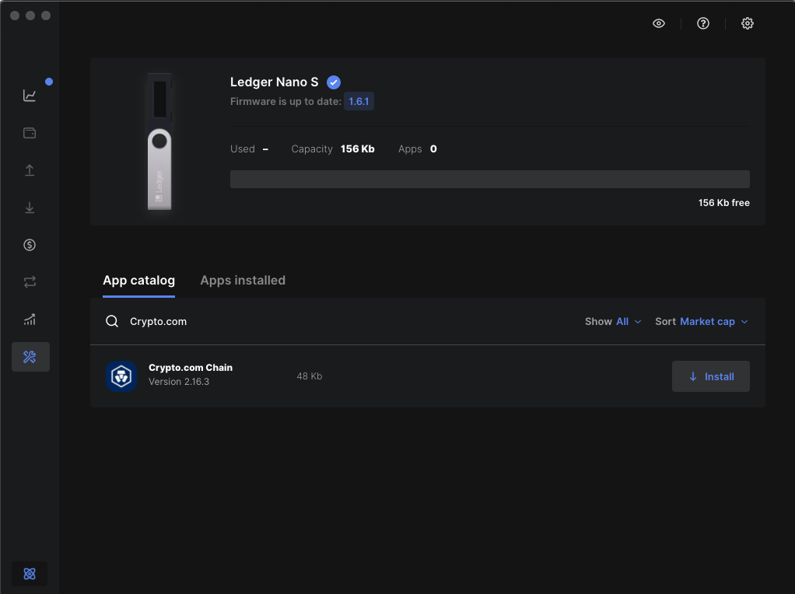
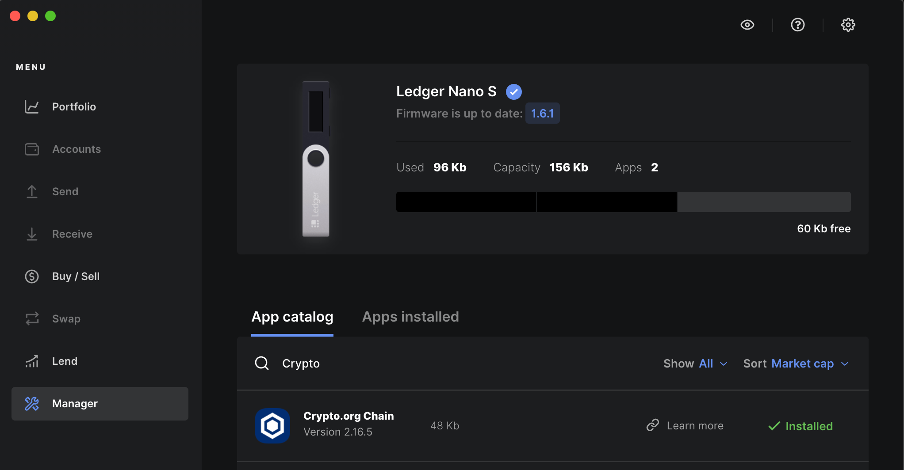
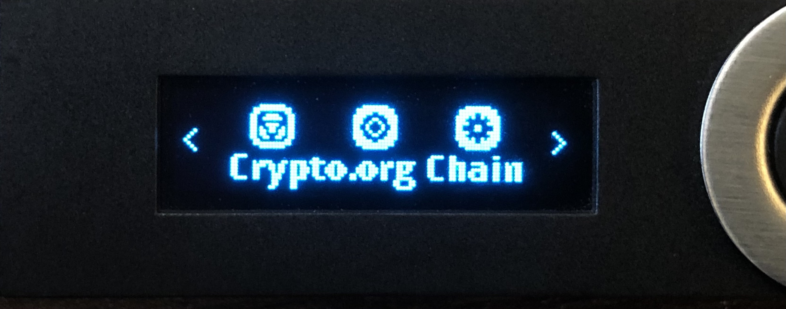
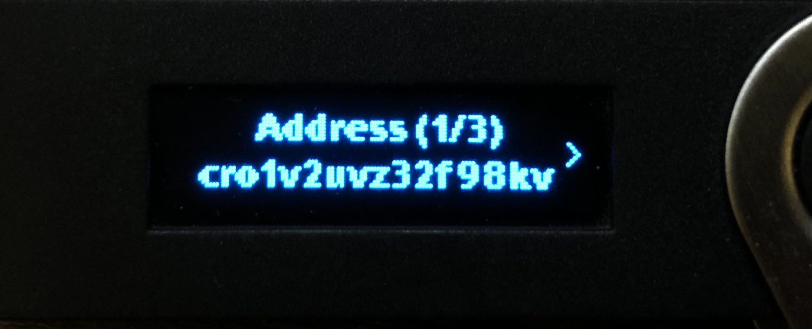

# Ledger Hardware Wallets with chain-maind

You can use your [Ledger hardware wallets](https://www.ledger.com/) to securely manage your CRO assets. Ledger devices are hardware wallets which store your private keys safely in the device and can be used in even unsafe PCs.

## Pre-requisites

- An initialized Ledger Nano device;
- Install the latest firmware on your device;
- [Ledger Live](https://www.ledger.com/ledger-live);
- Download our latest released `chain-maind` [ binary](https://github.com/crypto-org-chain/chain-main/releases).


### Technical support and enquiries
In case you have any enquiry about using Ledger device with desktop wallet, kindly send a message to the Crypto.org Chain [Discord](https://discord.gg/pahqHz26q4) #technical-questions channel for assistance.


## Install the Crypto.org app on your Ledger device
We will use Ledger Nano S for this illustration:

First of all, you will need to install the Crypto.org Chain app on your Ledger device. Kindly make sure your Ledger Live is updated to the latest version. 

- **Step 1** - On the Ledger Live, under "*Experimental Features*", enable "*Developer mode*" to show developer and testnet apps in the manager settings as below:

    

- **Step 2** - Connect and unlock your Ledger device

- **Step 3** - On your Ledger device, go to "*install app*", It should show "*Open Ledger live to install apps*"

- **Step 4** - On the Ledger Live, find and install Crypto.org Chain in the app catalog as below:
        

- **Step 5** - Your Ledger device will display "*Processing…*". Once the installation is completed, you should see "*Installed*" on your Ledger Live as below:
        

    You can confirm the installation by checking if the Crypto.org App shows up in the main menu of your Ledger device:
            

**Remark**: Once the Crypto.org App is successfully installed, please close the Ledger Live app before proceeding to the next step .

## Generate Address with Ledger device

1. Connect and unlock your Ledger device
1. Open "Crypto.org Chain" app on the device
1. Run in your terminal
    ```bash
    $ ./chain-maind keys add [name] --ledger --keyring-backend=test
    ```

    - `name` is an arbitrary name for your new key

1. An address will be displayed on your Ledger device, for example:
            
1. Confirm the address on your Ledger device and verify the address displayed on the terminal. They should match with each other, for example, of we create a wallet named `ledger_test`, you should see the same address displayed on you terminal after confirming and pressing "*Ok*" on your ledger device:
    ```bash
    - name: ledger_test
    type: ledger
    address: cro1v2uvz32f98kvf2k6tec7pqp4t5hhen6vr5a8ms
    pubkey: cropub1addwnpepq09tkjulrexy0r8atsjknpemk7nelswr3vj8p78hdag62phdhwgzgnpxrmg
    mnemonic: ""
    threshold: 0
    pubkeys: []
    ```

1. Your address is generated successfully. You can now use the address for any chain operations.

## Query account balance

You can query its balance by running in terminal

```bash
$ ./chain-maind query bank balances [address]
```

`address` is the address you have generated. If you didn't copy your address, you can query the address listing it in terminal:

```bash
$ ./chain-maind keys list --keyring-backend=test
```

## Sign a transaction

In this tutorial we will send a `MsgSend` transaction securely signed by your Ledger device to the chain.

1. Connect and unlock your Ledger device
1. Open "Crypto.org Chain" app on the device
1. For example, if you would like to send `1cro` in the mainnet, in your terminal, you can run:
    ```bash
    $ ./chain-maind tx bank send [from-address] [to-address] 1cro --chain-id="crypto-org-chain-mainnet-1" --ledger --keyring-backend=test  --sign-mode=amino-json
    ```

    - `from-address` is the from address [generated](#generate-address-with-ledger-device) by your Ledger device
    - `to-address` is the destination address
    - In this command, we are sending `1trco` from the from address, you can specify other amounts you want.
1. You will be asked to confirm the details of transaction in your terminal, input `y` to confirm:
    ```bash
    $ ./chain-maind tx bank send tcro1tzhdkuc328cgh2hycyfddtdpqfwwu42ywyfvkj tcro1aaah6juc9n6wvkkkr4zdn073n8gt7waha39xsv 1tcro --chain-id=testnet-croeseid-2 --ledger --keyring-backend=test  --sign-mode=amino-json
    {"body":{"messages":[{"@type":"/cosmos.bank.v1beta1.MsgSend","from_address":"tcro1tzhdkuc328cgh2hycyfddtdpqfwwu42ywyfvkj","to_address":"tcro1aaah6juc9n6wvkkkr4zdn073n8gt7waha39xsv","amount":[{"denom":"basetcro","amount":"100000000"}]}],"memo":"","timeout_height":"0","extension_options":[],"non_critical_extension_options":[]},"auth_info":{"signer_infos":[],"fee":{"amount":[],"gas_limit":"200000","payer":"","granter":""}},"signatures":[]}

    confirm transaction before signing and broadcasting [y/N]: y
    ```
1. Transaction details will be displayed on your Ledger device, you can click the right button to read the different details.
1. Read the transaction details carefully and confirm ONLY when you have reviewed all the details are correct.
1. The transaction is signed and will be broadcasted.
1. Wait for a while, and the broadcast result will be shown in your terminal.

