# Using Ledger device with desktop wallet

### Crypto.org Chain Desktop Wallet 
Crypto.org Chain Desktop Wallet Beta supports sending and staking operations, latest version can be found on the [release page](https://github.com/crypto-com/chain-desktop-wallet/releases). 

The following are the step-by-step instructions for the use of Ledger devices with Crypto.org Chain desktop wallet. Before starting the process, you will need:
 
- An initialized Ledger device (Nano S / Nano X) with latest firmware;
- Latest version of [Ledger Live](https://www.ledger.com/ledger-live);
- [Crypto.org Chain desktop wallet](https://github.com/crypto-com/chain-desktop-wallet/releases).

### Technical support and enquiries
In case you have any enquiry about using Ledger device with desktop wallet, kindly send a message to the Crypto.org Chain [Discord](https://discord.gg/pahqHz26q4) #desktop-wallet channel for assistance.

## Install the Crypto.org Chain desktop wallet app for Ledger and create the wallet  
We will use Ledger Nano S for this illustration:
### Step 1 - Install the Crypto.org Chain app on your Ledger device

- **Step 1.1** - Connect and unlock your Ledger device

- **Step 1.2** - On your Ledger device, go to "*Install app*", It should show "*Open Ledger live to install apps*"

- **Step 1.3** - On the Ledger Live, find and install Crypto.org Chain in the app catalog under "*Manger*" as below:
        

- **Step 1.4** - Your Ledger device will display "*Processing…*". Once the installation is completed, you should see "*Installed*" on your Ledger Live as below:
        

    You can confirm the installation by checking if the Crypto.org App shows up in the main menu of your Ledger device:
            

**Remark**: Once the Crypto.org App is successfully installed, please close the Ledger Live app before proceeding to the next step .

### Step 2 - Create wallet in Desktop Wallet with Ledger device

After the app is set, please conducting the following steps to create a wallet with the desktop wallet: 

- **Step 2.1** - Download the latest Crypto.org Chain desktop wallet [here](https://github.com/crypto-com/chain-desktop-wallet/releases)

- **Step 2.2** - Run the Crypto.org Chain desktop wallet and click "*Get started*":
        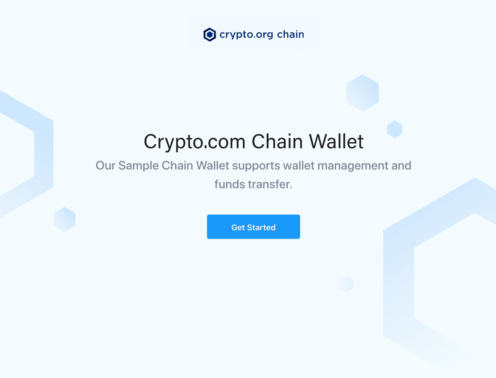

- **Step 2.3** - Before creating your wallet, you would need to create an App password to protect your desktop wallet:
        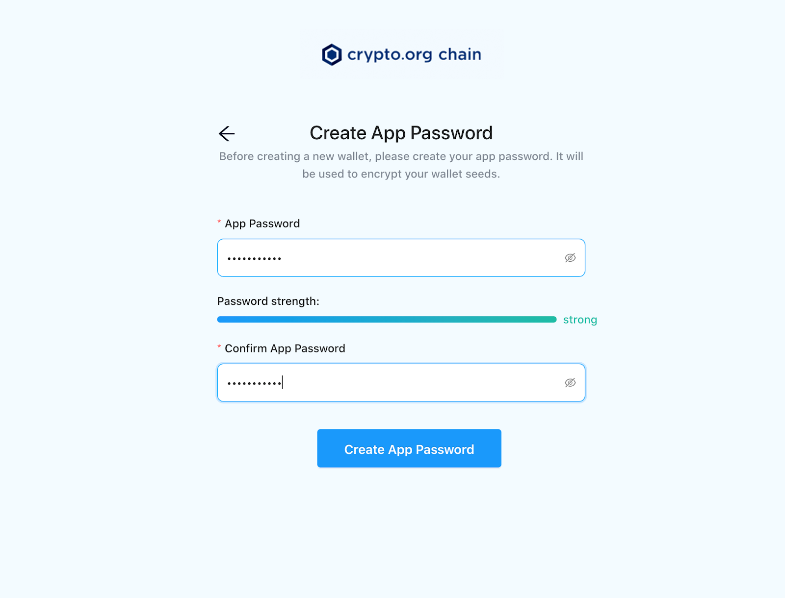

- **Step 2.4** - Afterwards, your wallet is ready to be created. Please make sure you select the following options accordingly:

    - Input your wallet name of your choice;
    - Tick "*Want to create with hardware wallet*" and choose "*Ledger*" as the wallet type. 
    - For the network, three options of "**Testnet**", "**Mainnet**", and "**Custom Devnet**" are given. **Testnet** is Croeseid testnet which is our Cosmos-based testnet that has been running since last October. **Mainnet** is refers to Crypto.org Chain mainnet. Other than these, you may fill up the custom configuration to your own network.
        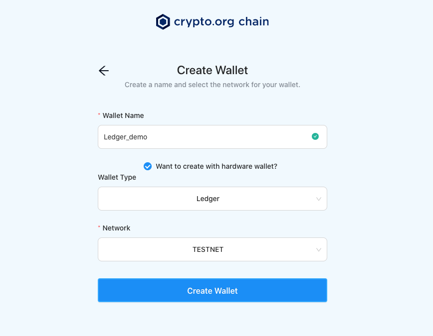
    In this demonstration, we will be creating a testnet address and connecting to the current Croeseid testnet, therefore, we select "**Testnet**" as the network option. 

- **Step 2.5** - Before clicking "*Create Wallet*", make sure you have unlocked and started your Crypto.org Chain App on your Ledger device. Also, you should be able to see "*Crypto.org Chain ready*" displayed on your device as follow: 
        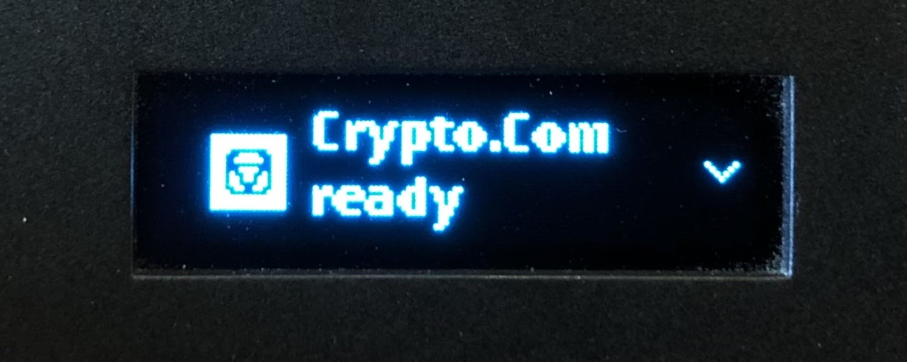    
    At this step, your wallet should be successfully created:
            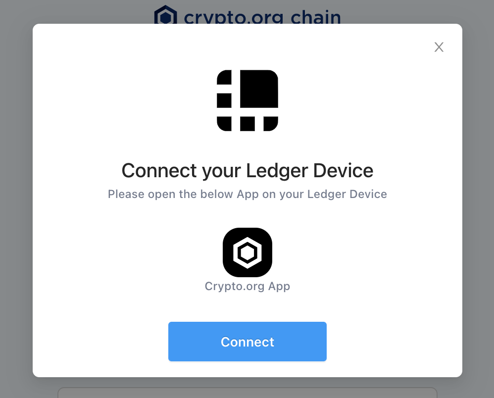

### Step 3 - Create wallet in Desktop Wallet with Ledger device
In order to start with the sending transaction/performing staking operations, we would need some funds to begin with:

- **Step 3.1** - Go to the "*Receive*" option in the desktop wallet and your wallet address will be displayed. Verify the address by clicking "*Verify address on Ledger*", you should see the same address being displayed on your ledger device as well.

- **Step 3.2** - Once the address has been confirmed, copy this address and request some funds from the [testnet faucet](https://crypto.org/faucet)

- **Step 3.3** - Your current balance will be available on the Home page. If you would like to view the transaction details, simply hit the hash link under Transaction Hash and it will direct you to the [explorer](https://crypto.org/explorer/) where different details related to transactions will be displayed:
            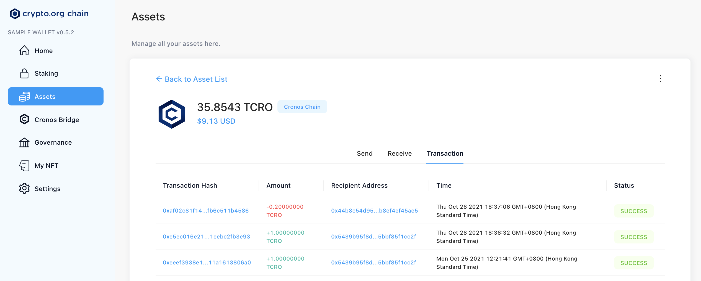

**Remark**: In case you have reached the daily limit on faucet airdrop, you can simply send a message on [Discord](https://discord.gg/pahqHz26q4) #request-tcro channel.

## Sending transaction with Ledger device

### Step 4 - Send funds in Desktop Wallet with Ledger device 

- **Step 4.1** - Sending funds is easy with the desktop wallet. Once you obtain some fund from the testnet faucet, go to the "*Send*" page, fill up the request information: recipient address, amount to be sent and optional memo as needed:
            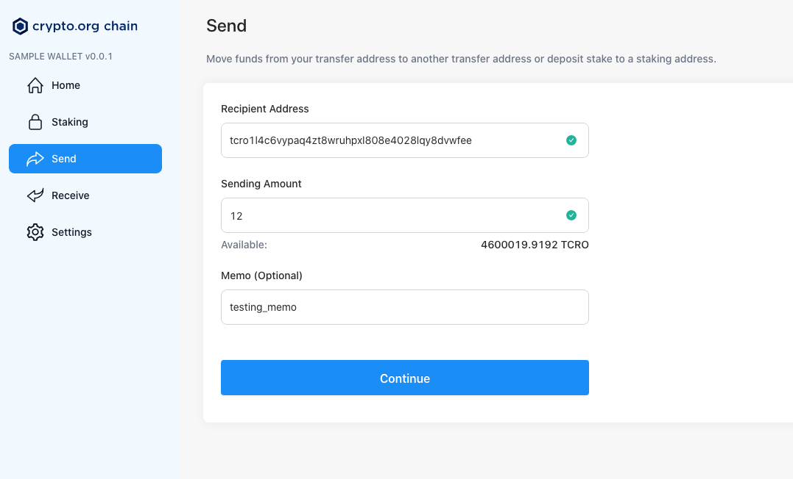

- **Step 4.2** - Once you hit the "*Continue*" button, you can review the transaction details in the confirmation window on the desktop wallet and proceed to the next step by clicking "*Confirm*":
            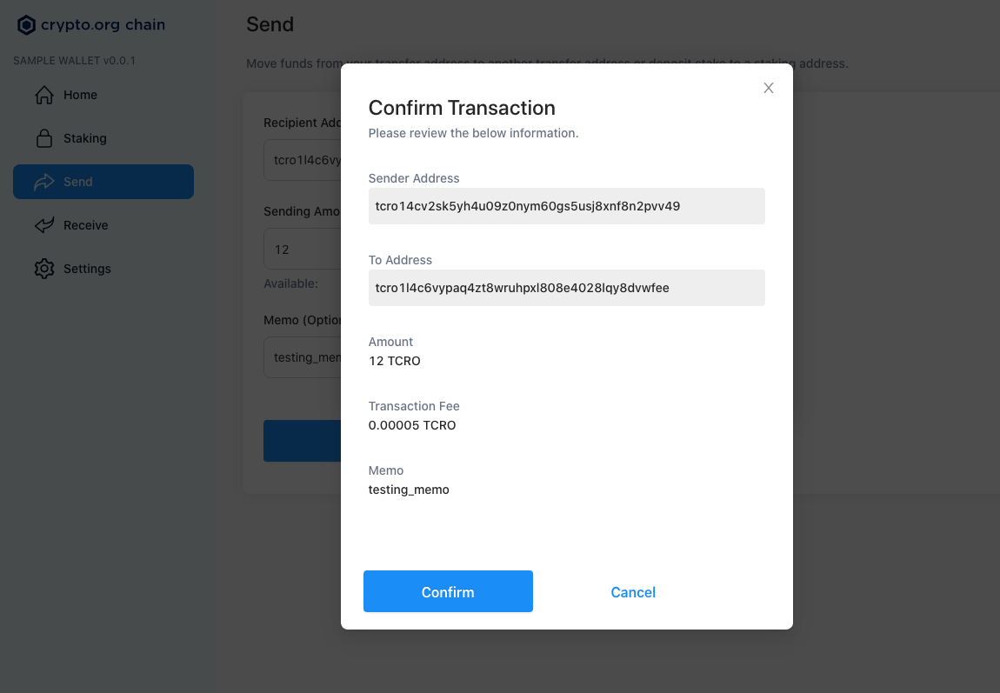

- **Step 4.3** - Now, your transaction details will be shown on your ledger device, which includes: 
Chain-id, Account number, sequence, Type of the transaction, the amount in "basetcro", Sender address, Receiver address, memo message, Transaction fee and gas:
            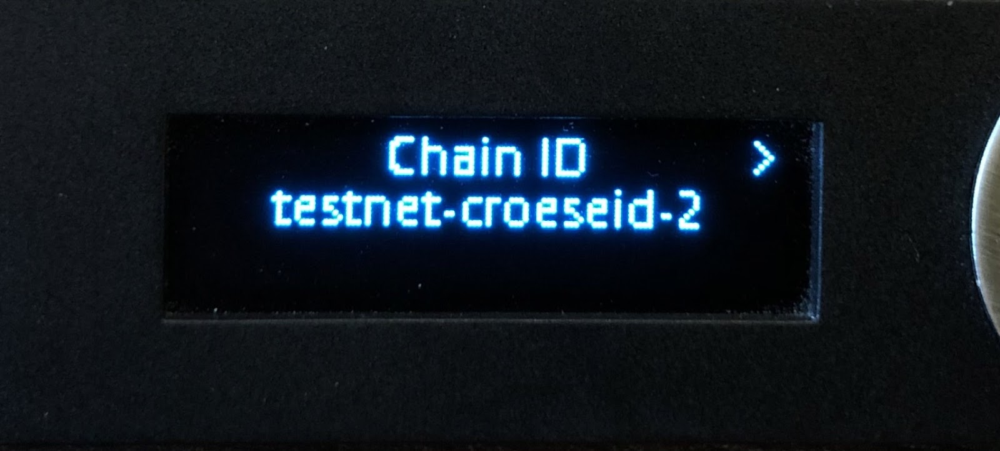
    - You can confirm the details and approve the transaction on the ledger device:
                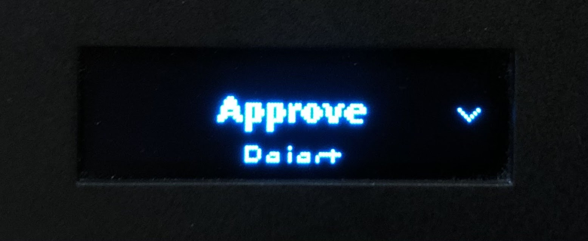
    - Once the transaction has been approved on you ledger device, you should see a success message on your Desktop Wallet:
                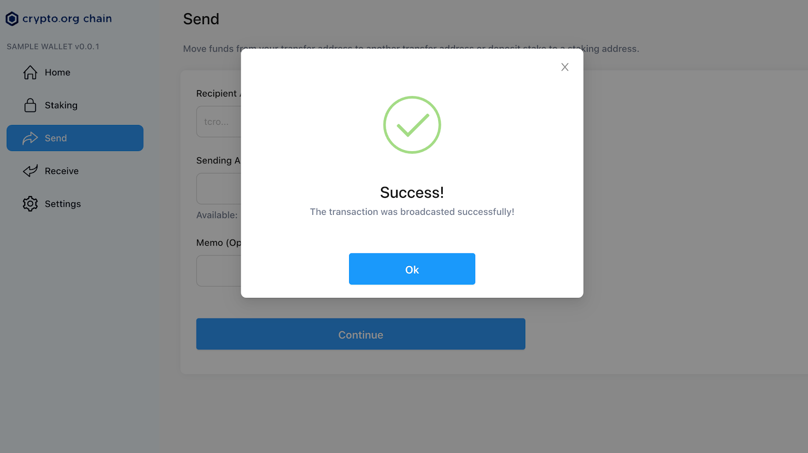
    - You can then check the transaction history at the "*Home* page. 

## Staking operation with Ledger device

Crypto.org Chain is based on Tendermint Core's consensus engine, it relies on a set of validators to participate in the proof of stake (PoS) consensus protocol who are responsible for committing new blocks in the blockchain. Token holders might stake their token to validators to secure the network and earn rewards. Particularly, we can:

- [Delegate to a validator](#delegate-to-a-validator-with-ledger-device);
- [Withdraw staking rewards from a validator](#withdraw-the-reward-from-a-validator-with-ledger-device);
- [Undelegate from a validator](#undelegate-the-staking-from-a-validator-with-ledger-device).

### Delegate to a validator with Ledger device

- To begin staking, please direct to "*Delegate Funds*" under the *Staking* option. You can choose one of the active validators that you would like to delegate to, copy their validator’s "*Operator Address*" (begin with `tcrocncl...` for testnet), put it under "*Validator address*" and specify the amount that you would like to delegate:
            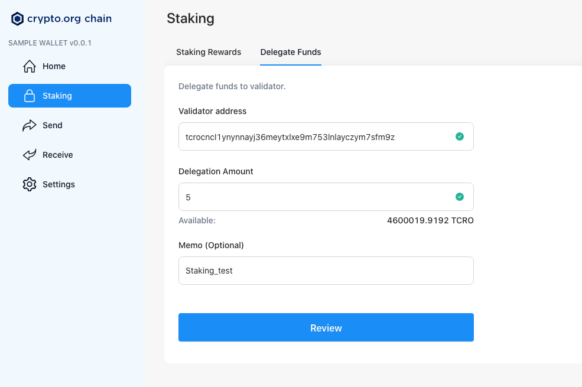
    Note that you can look up validators and their operator address by the validator list on the [explorer](https://crypto.org/explorer/validators).
- Similar to sending a [transaction](#step-4-send-funds-in-desktop-wallet-with-ledger-device), you can review and confirm the transaction details on the Desktop Wallet first shown as below, click "*Confirm*" and then approve it on your ledger device. 
            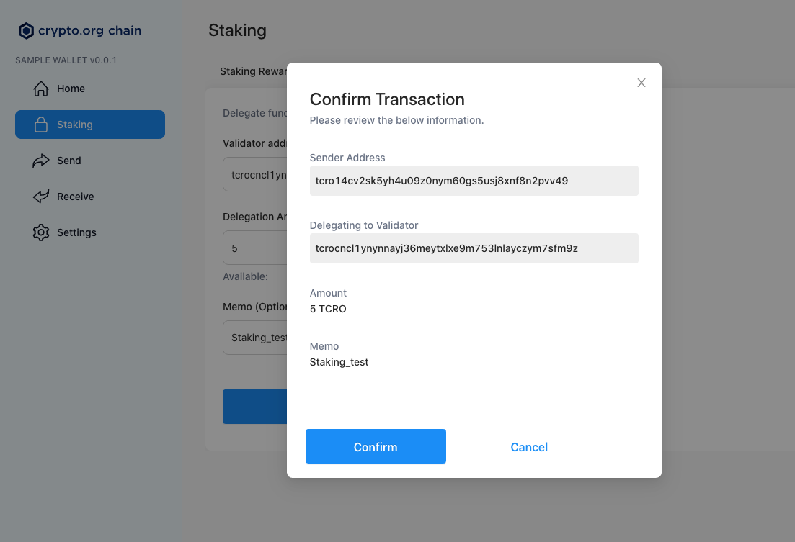
- Once the transaction has been approved on you ledger device, you should able to see a success message on your Desktop Wallet:
            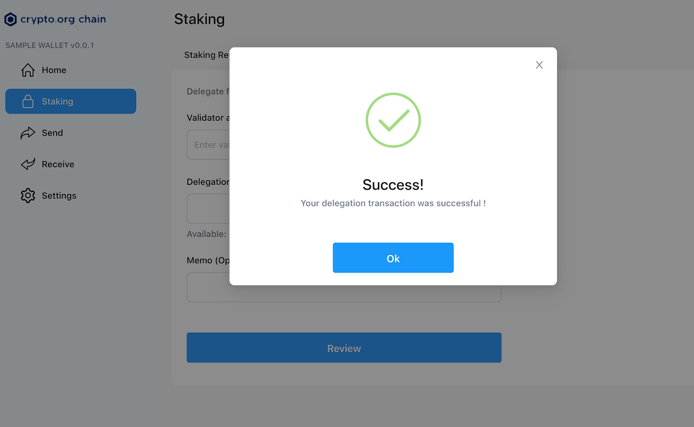

### Withdraw the reward from a validator with Ledger device

- Under "*Staking Rewards*" on the Staking page, your staking reward amount from different validators will be displayed as below:
            
- Similar to sending a [transaction](#step-4-send-funds-in-desktop-wallet-with-ledger-device), you can review and confirm the transaction details on the Desktop Wallet first, click "*Confirm*" and approve it on your ledger device:
            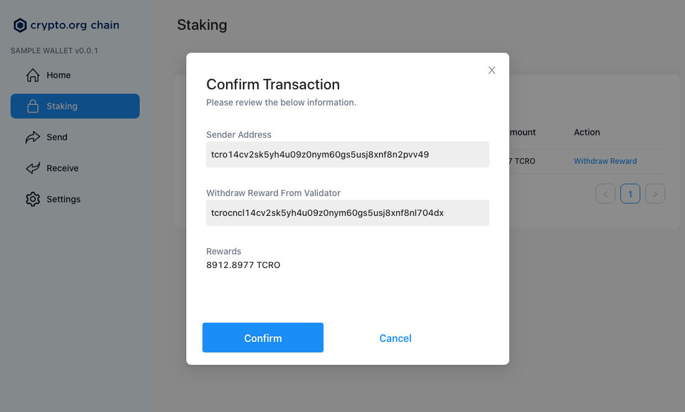
**Remark**: Please note that all of your available reward from a validator will be withdrawn in the transaction.

- Once the transaction has been approved on you ledger device, you should see a success message on your Desktop Wallet:
            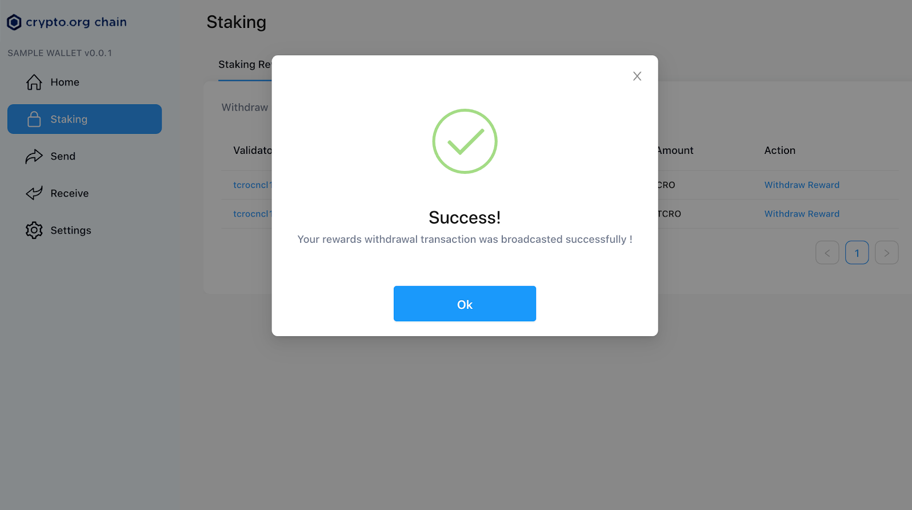

### Undelegate the staking from a validator with Ledger device

Similarly, you can undelegate your staked funds from a validator, and check your current delegation status under the page "*Home-Delegation*", for example: 
            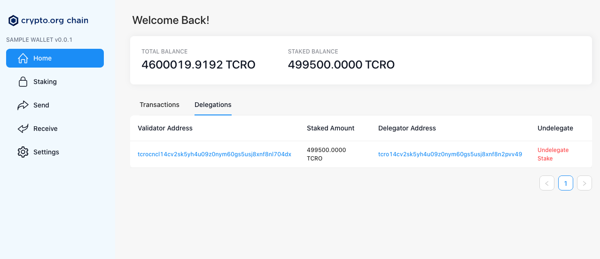
- You can undelegate your staked tokens from a validator by clicking "*Undelegate Stake*". Afterwards, you can specify the amount of token that you would like to undelegate from a validator, review and confirm the transaction details on the Desktop Wallet, click "*Confirm*" and approve it on your Ledger device 
            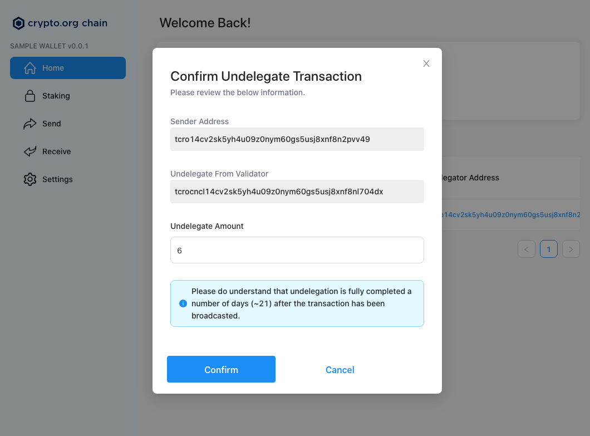
