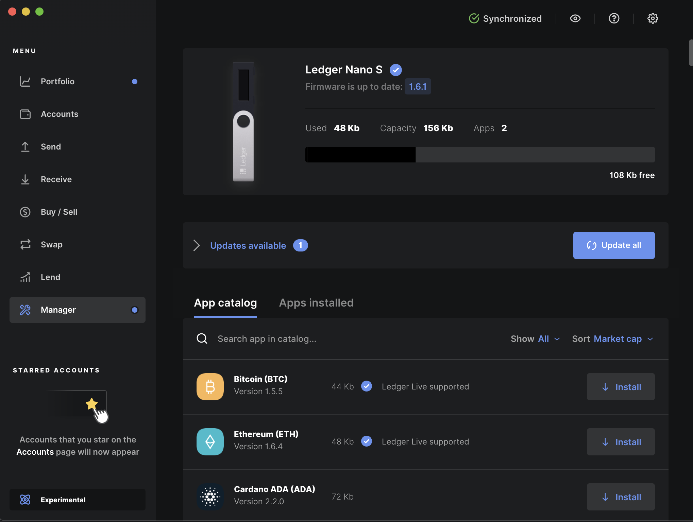
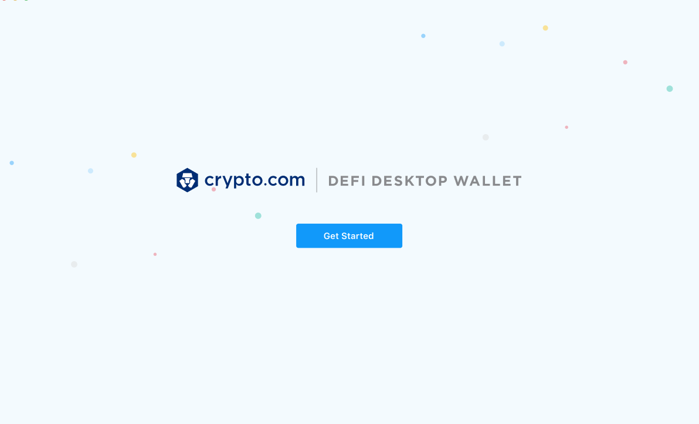
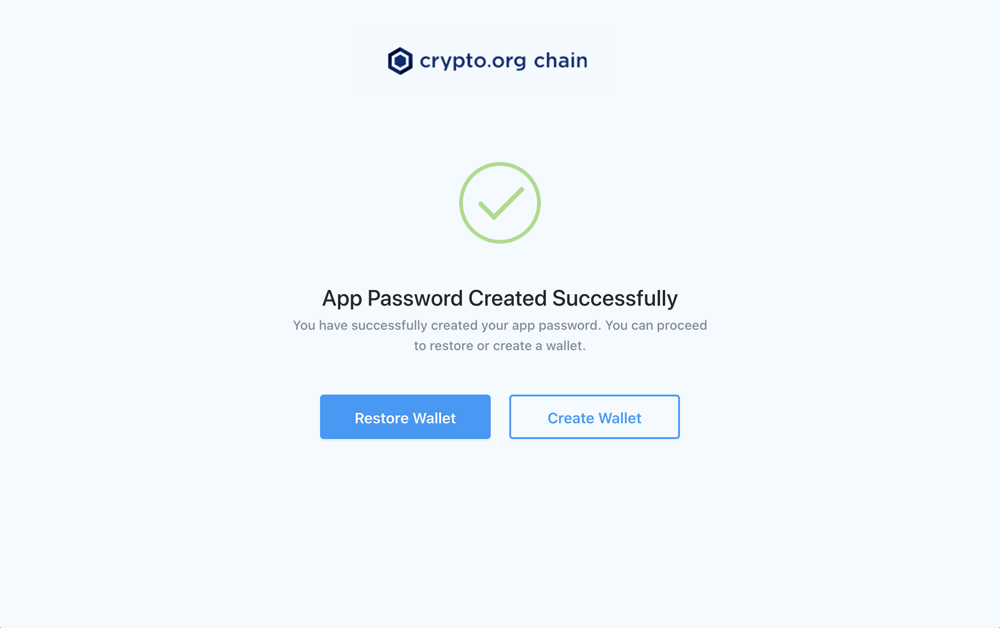
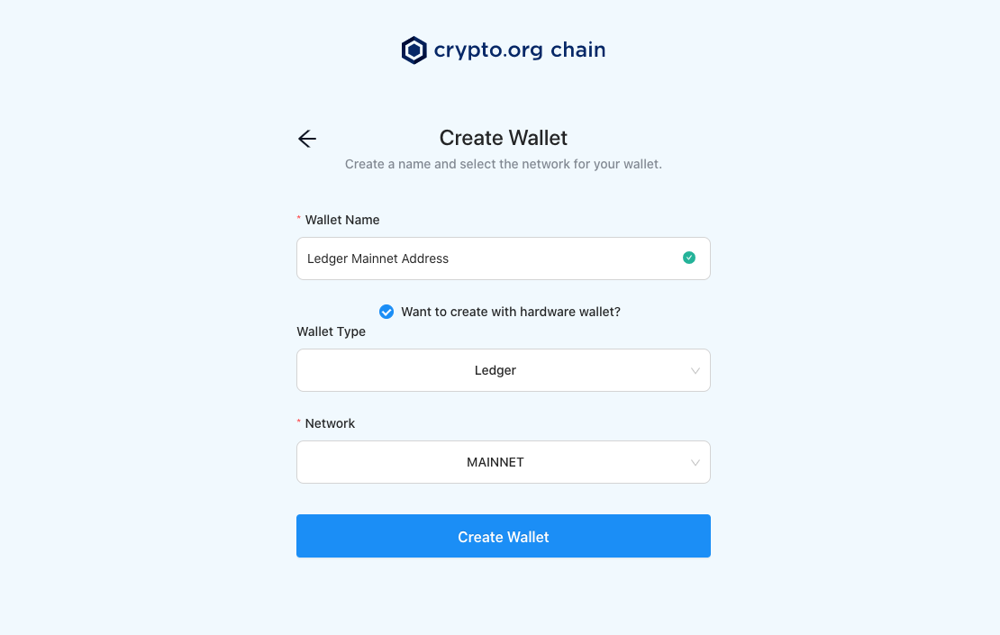
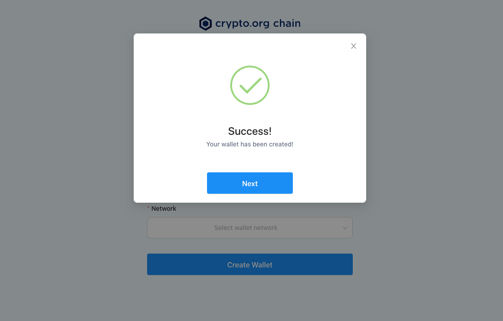
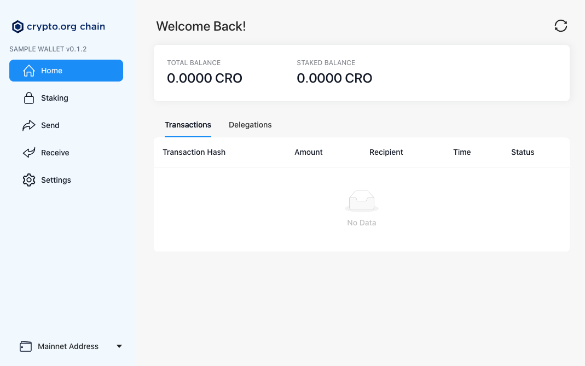
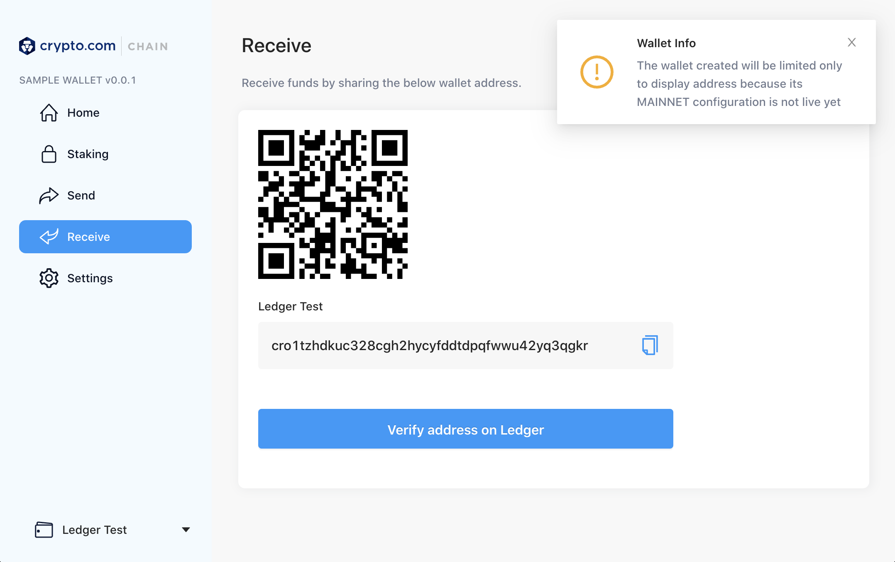
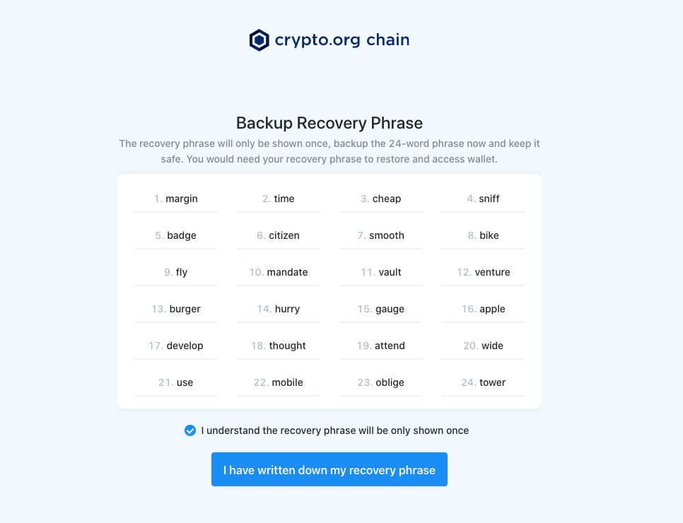
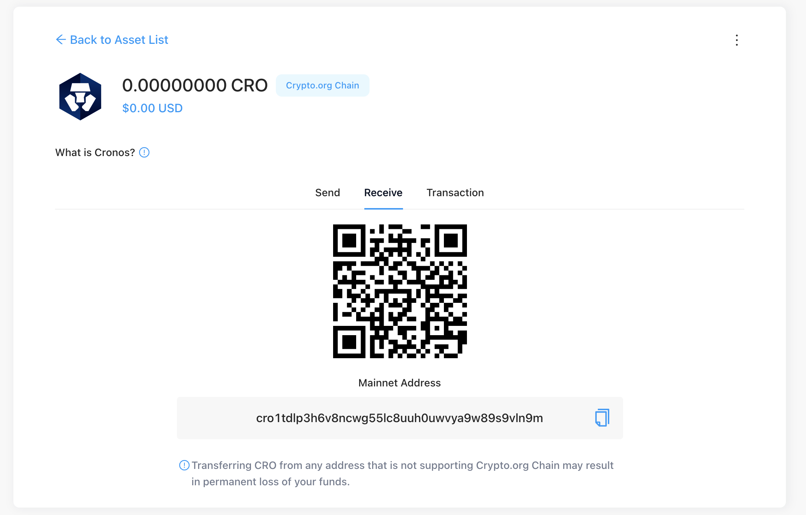

# Mainnet Address Generation

This document contains the information of account address for Cronos POS Chain mainnet.

## Address prefix

Account address for mainnet starts with prefix `cro`. For example: `cro1y8ua5laceufhqtwzyhahq0qk7rm87hhugtsfey`.

## Hierarchical Deterministic Wallet (HD Wallet) Derivation Path

Cronos POS Chain has [registered](https://github.com/satoshilabs/slips/blob/master/slip-0044.md) coin type `394` as defined in [BIP44 standard](https://github.com/bitcoin/bips/blob/master/bip-0044.mediawiki).

Coin Type: 394\
Derivation Path: `44'/394'/0'/0/{index}` where index starts from 0.

i.e. the first address is derived at path `44'/394'/0'/0/0` and the second one at path `44'/394'/0'/0/1`.

## How to generate an address


**MAKE SURE YOU BACKUP YOUR MNEMONIC WORDS**\
Before you use the generated mainnet addresses to receive funds on mainnet, make sure that you have backed up your address's mnemonic words correctly in a safe place and that the mnemonic words are correct such that they can be restored to your wallet address in the future.\
You are the sole owner of your wallet mnemonic words and there is no way for Cronos POS Chain team to restore your wallet or recover your funds if you lost the mnemonic words.&#x20;



**GENERATE ADDRESS ONLY IN A SECURE ENVIRONMENT**\
We recommend you generate an address only on a trusted and secure computer. To further enhance the security, you should consider running on an air-gapped (offline) machine.&#x20;



**ALWAYS VERIFY YOUR MNEMONIC WORDS AND ADDRESS**\
To make sure you have backed up the mnemonic words correctly, we recommend you try to restore your wallet with the mnemonic words and verify the address derived is the same.

For more details on how to verify your mnemonic words and addresses, please check [Mainnet Address Verification](mainnet-address-verification.md)&#x20;


There are four ways to generate the mainnet address by using:

* [Release Binary (CLI)](mainnet-address-generation.md#a-release-binary-cli);
* [Ledger Wallet](mainnet-address-generation.md#b-ledger-wallet);
* [Programmatically via Cronos POS Chain JavaScript Library](mainnet-address-generation.md#c-programmatically); and
* [Crypto.com Defi Desktop Wallet](mainnet-address-generation.md#d-crypto-org-chain-desktop-wallet-beta).

## A. Release Binary (CLI)

Supported OS: Linux, Mac OS, and Windows

#### Step 1. Get the Cronos POS Chain binary

Download the Cronos POS Chain Binary for Mainnet from the [release page](https://github.com/crypto-org-chain/chain-main/releases) and extract the binary. Here we used Linux as an example:

```bash
 $ curl -LOJ https://github.com/crypto-org-chain/chain-main/releases/download/v3.3.9/chain-main_3.3.9_Linux_x86_64.tar.gz
 $ tar -zxvf chain-main_3.3.9_Linux_x86_64.tar.gz
```

If you are downloading the binary for other operating systems, make sure you are downloading `v3.3.9` or newer versions that are targeting for mainnet.

Before moving to the next step, kindly check your `chain-maind` version by

```bash
$ ./chain-maind version
3.3.9
```

#### Step 2. Create a new key and address

Run the following command to create a new address. For example, you can create a key with the name "Default" by:

```bash
$ ./chain-maind keys add Default
```

You can find the generated address after running the command. **Please make sure that you have safely backed up the mnemonic words that appear on the last line.**

```bash
- name: Default
  type: local
  address: cro1qxm5lwml3v36h4pygwnn5nfzesupg7cx8nyfkt
  pubkey: cropub1addwnpepqg95fk5grlyucrnvdu8v3h4qnhgcm03ust4yysgtvdjqnh2ytmg6syjkav6
  mnemonic: ""
  threshold: 0
  pubkeys: []


**Important** write this mnemonic phrase in a safe place.
It is the only way to recover your account if you ever forget your password.

scare blur bless unfair chat gadget leaf reveal job depend daughter unveil fatal cliff bus beach betray over later rent planet alert remove cactus
```

## B. Ledger Wallet

* Supported OS: Linux, Mac OS and Windows
* Pre-requisite: Ledger Hardware Wallet

### Step 1. Install Ledger Application

#### Step 1-1. Plug in your Ledger device to your computer. If you are using Ledger Nano X, please connect to your computer using the USB-C cable.

#### Step 1-2. Click "Manager" on the left navigation menu. Confirm to "Allow Ledger Manager" on your Ledger device.



#### Step 1-3. Search for "Cronos POS Chain" and install the application to your Ledger.


#### Step 1-4. Confirm the installation

You can confirm the installation by checking if the Cronos POS Chain App shows up in the main menu of your Ledger device:

<div align="left"><figure><figcaption></figcaption></figure></div>

***

## B-i. Ledger Wallet via Release Binary (CLI)

#### Step 1. Get the Cronos POS Chain binary

Download the Cronos POS Chain Binary for Mainnet from [release page](https://github.com/crypto-org-chain/chain-main/releases) and extract the binary. Here we used Linux as an example:

```bash
$ curl -LOJ https://github.com/crypto-org-chain/chain-main/releases/download/v3.3.9/chain-main_3.3.9_Linux_x86_64.tar.gz
$ tar -zxvf chain-main_3.3.9_Linux_x86_64.tar.gz
```

If you are downloading the binary for other operating systems, make sure you are downloading `v3.3.9`, which is the version targeting for mainnet.

#### Step 2. Open the Cronos POS Chain application on your Ledger device

#### Step 3. Create a new key and address

Run the following command to create a new address. For example, you can create a key with the name "Default" by:

```bash
$ ./chain-maind keys add Ledger --ledger
```

You will be prompted with the address on your Ledger device screen. Read it carefully and write it down. Afterward, confirm the address on your Ledger device.


Cannot Connect To Your Ledger Device?&#x20;

If you encounter a connection error when creating a wallet, you can try to unplug and plug your Ledger device into your computer again. Please make sure your Ledger device is unlocked and you have opened the "Cronos POS Chain" application on your Ledger.


#### Step 4. Verify the address displayed on the terminal, and make sure it matches the address you saw on Ledger device

```bash
- name: Ledger
  type: ledger
  address: cro1tzhdkuc328cgh2hycyfddtdpqfwwu42yq3qgkr
  pubkey: cropub1addwnpepqw802qz5mvdcchlekqnypgj5vw3hef75yjw6gw6wda823aa0wrdwc7pl4n9
  mnemonic: ""
  threshold: 0
  pubkeys: []
```

***

## B-ii. Ledger Wallet via Crypto.com Defi Desktop Wallet

Please be aware of the [potential risks](https://github.com/crypto-com/chain-desktop-wallet#warning) of using it in mainnet. You should run it only on a trusted, safe and offline computer and always verify the mnemonic words before using the address. ::: Download the latest version of the Crypto.com Defi Desktop Wallet [here](https://github.com/crypto-com/chain-desktop-wallet/releases) and follow the steps below to create an address:

#### Step 1. Open the application and click "Get Started" to set up an application password.



#### Step 2. After setting up the password, click "Create Wallet".



#### Step 3. Fill in any wallet name of your choice and choose "MAINNET" as the network. Then check "Want to create with hardware wallet?" and choose "Ledger" as "Wallet Type"

 

#### Step 4. Upon successful wallet creation, a warning message will be shown on the top right hand corner to remind you that the wallet is for address generation only and may not work when mainnet launches.


**Cannot Connect To Your Ledger Device?** \
If you encounter a connection error when creating a wallet, you can try to unplug and plug your Ledger device into your computer again. Please make sure your Ledger device is unlocked and you have opened the "Cronos POS Chain" application on your Ledger.




#### Step 5. You can check the wallet address by clicking the "Receive" tab inside any token assets. Click "Verify address on Ledger" and the generated address will appear on your Ledger device screen for verification.



## C. Programmatically

You can generate the Mnemonic and address programmatically. Here is an example code snippet written in JavaScript using the [Cronos POS Chain JavaScript Library](https://github.com/crypto-com/chain-jslib) to generate the mnemonic and the mainnet address:

```javascript
// Import the library
const sdk = require("@crypto-com/chain-jslib");
const HDKey = sdk.HDKey;
const Secp256k1KeyPair = sdk.Secp256k1KeyPair;

// Initializing the library configurations with TestNet config
const cro = sdk.CroSDK({ network: sdk.CroNetwork.Testnet });

// Generating a random mnemonic words
const randomHDKey = HDKey.generateMnemonic(24); // This returns a 24 words mnemonic phrase

// Display the mnemonics words to the terminal. Only do this in a trusted, safe and offline computer.
// You may consider to store it securely instead of logging it.
console.log(randomHDKey);

// Derive a private key from an HDKey at the specified path
const privateKey = randomHDKey.derivePrivKey("m/44'/1'/0'/0/0");

// Getting a keyPair from a private key
const keyPair = Secp256k1KeyPair.fromPrivKey(privateKey);

// Generate address from the key pair
const address = new cro.Address(keyPair).account();
console.log(address);
```

## D. Crypto.com Defi Desktop Wallet

Supported OS: Ubuntu, Mac OS, and Windows


DESKTOP WALLET IS IN BETA Desktop wallet is in beta testing. \
Please be aware of the [potential risks](https://github.com/crypto-com/chain-desktop-wallet#warning) of using it in mainnet. You should run it only on a trusted, safe, and offline computer and always verify the mnemonic words before using the address.


Download the latest version of the Crypto.com Defi Desktop Wallet [here](https://github.com/crypto-com/chain-desktop-wallet/releases) and follow the steps below to create an address:

#### Step 1. Open the Cronos POS Chain application on your Ledger device

#### Step 2. Open the application and click "Get Started" to set up an application password.


#### Step 3. After setting up the password, click "Create Wallet".


#### Step 4. Fill in any wallet name of your choice and choose "MAINNET" as the network. Then create the wallet by clicking "Create Wallet"

 

#### Step 5. Upon successful wallet creation, a list of 24 mnemonic words will be displayed. Make sure you have copied and stored your mnemonic words in a safe place.



#### Step 6. A warning message will be shown on the top right hand corner to remind you that the wallet is for address generation only and may not work when mainnet launches.


#### Step 7. You can check the wallet address by clicking the "Receive" tab on the left navigation menu.


