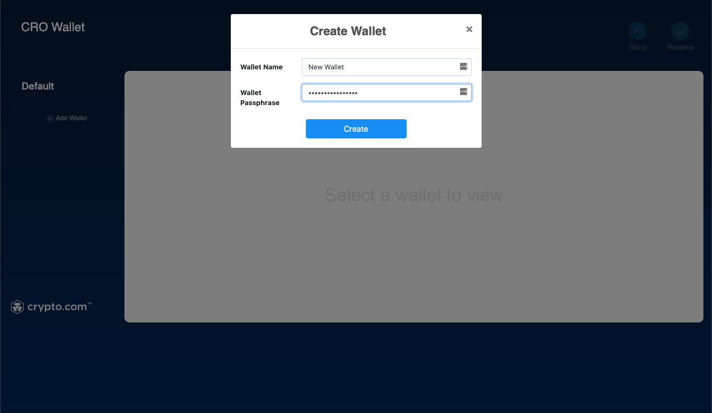
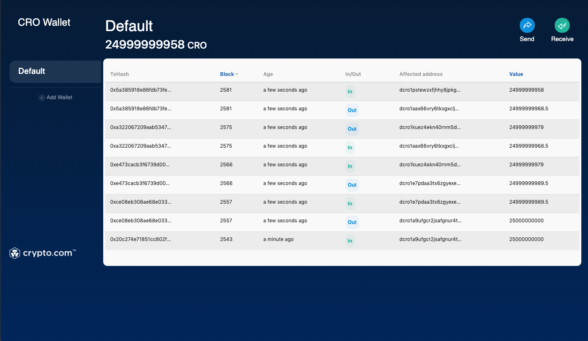
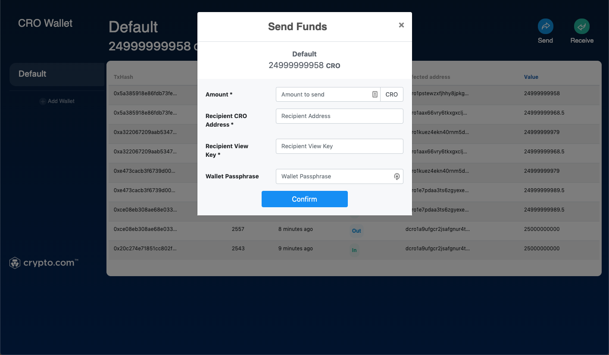
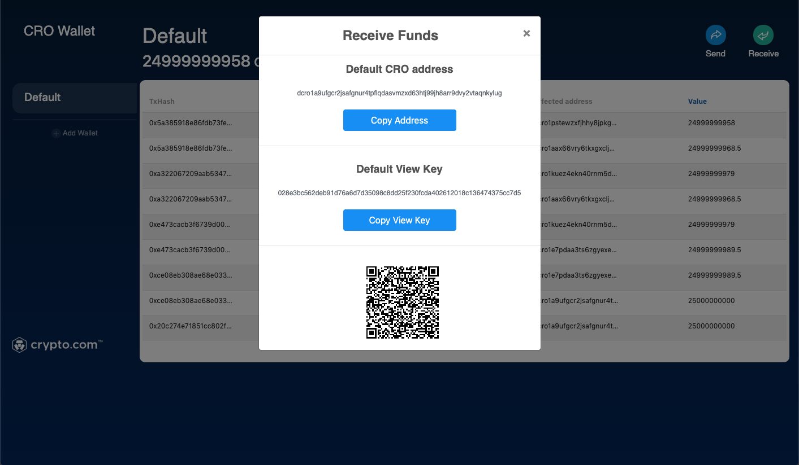

# Sample Chain Wallet

Sample Chain Wallet is a sample implementation of the wallet client with a graphical user interface. It supports wallet management and funds transfer.

    

## Build

Right now, the Sample Chain Wallet does not provide one-click installation or pre-built binary. You will have to build from source code.

Please follow the [instructions](https://github.com/crypto-com/sample-chain-wallet) to build and run the sample wallet.

## Start ClientRPC

Sample wallet is powered by [ClientRPC](./client-rpc.md). To run the Sample Wallet, you will have to start the ClientRPC by following the [instructions](./client-rpc.md#build).

## Wallet Management

### Create Wallet

1. Click "Add Wallet" at the left side navigation menu;
2. Enter your desired wallet name and passphrase in the popup;
3. Click "Create", and your wallet is created.

    

### Wallet List

Wallet you owned are listed at the left side navigation menu

### List Transactions

1. Select a wallet from the wallet list;
2. Unlock your wallet with the passphrase;
3. You can view the list of transactions related to this wallet.

    

## Send and Receive Funds

### Send Funds

To send funds to another address, you will have to first obtain the other party's address and their view key.

1. Unlock your wallet with the passphrase;
2. Click the *Send* button on the top right-hand corner;
3. Fill in the amount, recipient CRO address, view key and confirm with your passphrase;
4. Click *Confirm*;
5. Preview and make sure the information is correct;
6. Click *Send*.

    

### Receive Funds

To receive funds, you will need to present your address and view key to the sender; these can be obtained by:

1. Unlock your wallet;
2. Click *Receive* at the top right-hand corner;
3. Copy your recipient address and view key.

    

