# 🛠️ Token Migration Web Tool

Token migration is the process of migrating your ERC20 CRO to Mainnet CRO.

This tutorial will guide you through the steps to migrate your ERC20 CRO to Mainnet CRO using the token migration web tool. This method is suitable for non-custodial wallet users.


**Other Migration Methods**&#x20;

The Migration Web Tool targets advanced crypto users. It requires more complicated steps. For most users, we recommend using other migration methods such as [Crypto.com App](https://crypto.com/en/wallet), [Crypto.com Onchain wallet](https://crypto.com/en/defi/wallet/), or through our featured exchanges.


## Preparation

To use the web tool, you must first fulfill the following requirements

* [MetaMask Wallet](https://metamask.io/) (Right now we only support connecting with MetaMask browser wallet);
* ERC20 CRO on your MetaMask Account;
* A small amount of Ethereum on your MetaMask Account (For paying Ethereum transaction fee).

## How to migrate


You Will Need to Burn Your ERC20 CRO To use the migration web tool to migrate your CRO, you will have to first burn the ERC20 CRO and then submit the migration request. There will be a period of time before the CRO appears on your mainnet address. You will not be able to access your funds during this migration period.


### Table of Content

1. [Request a new token migration](token-migration.md#request-a-new-token-migration)
   * Suitable for users who want to initiate a new token migration request
2. [Re-submit migration request](token-migration.md#re-submit-migration-request)
   * Suitable for users who have failed to submit previous token migration but have already burnt the ERC20 CRO

## Request A New Token Migration

### 1. Open Web Tool

Go to [Token Migration](https://crypto.org/migration) website and click "Open Web Tool".

<figure>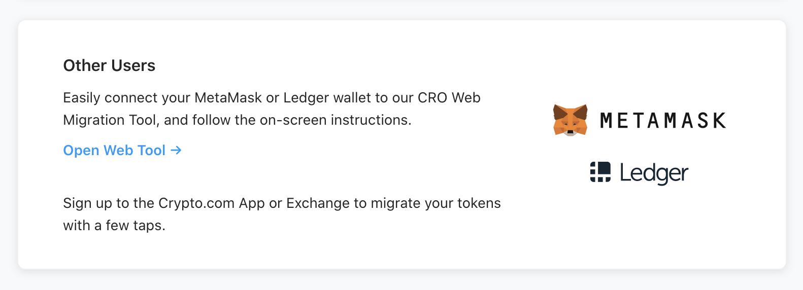<figcaption></figcaption></figure>

### 2. Connect to MetaMask Wallet

#### 2.1 Click "Connect Now"

<figure>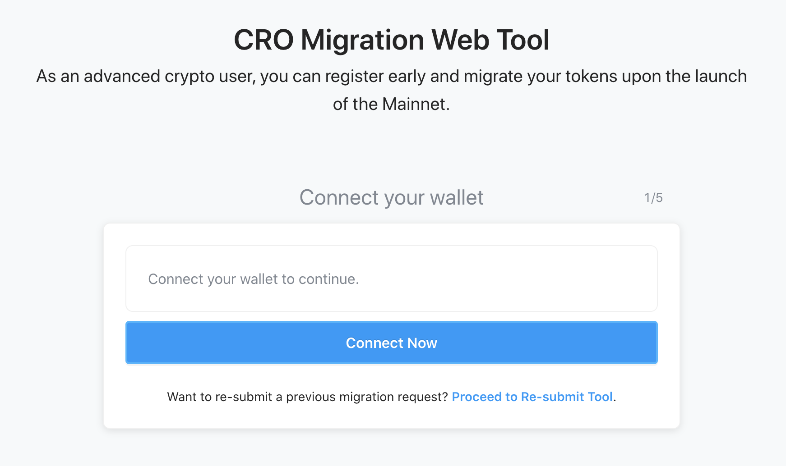<figcaption></figcaption></figure>

#### 2.2 Choose "MetaMask" on the wallet list

<figure>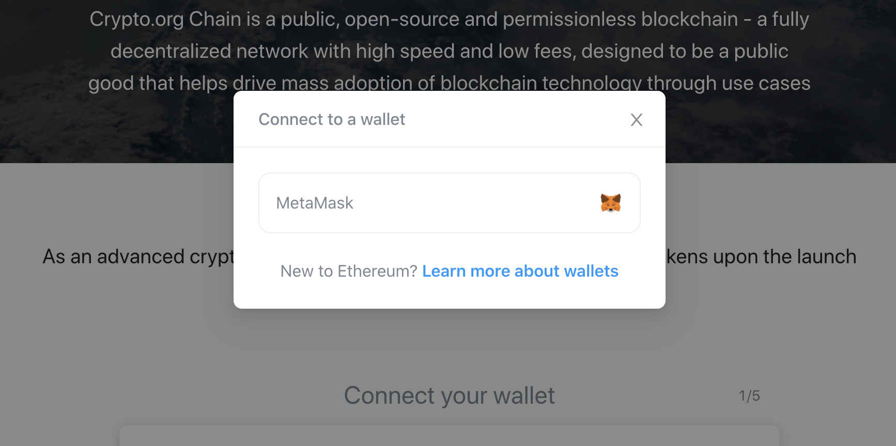<figcaption></figcaption></figure>

### 3. Fill in Your Mainnet Address


**How to Generate Mainnet Address**&#x20;

To generate a mainnet address, please refer to the [mainnet address generation guide](../docs/wallets/mainnet-address-generation.md)


Fill in the mainnet address you want to receive the migrated CRO. If the address is valid, you will see a green tick next to the address. After you have completed, click "Continue".

<figure>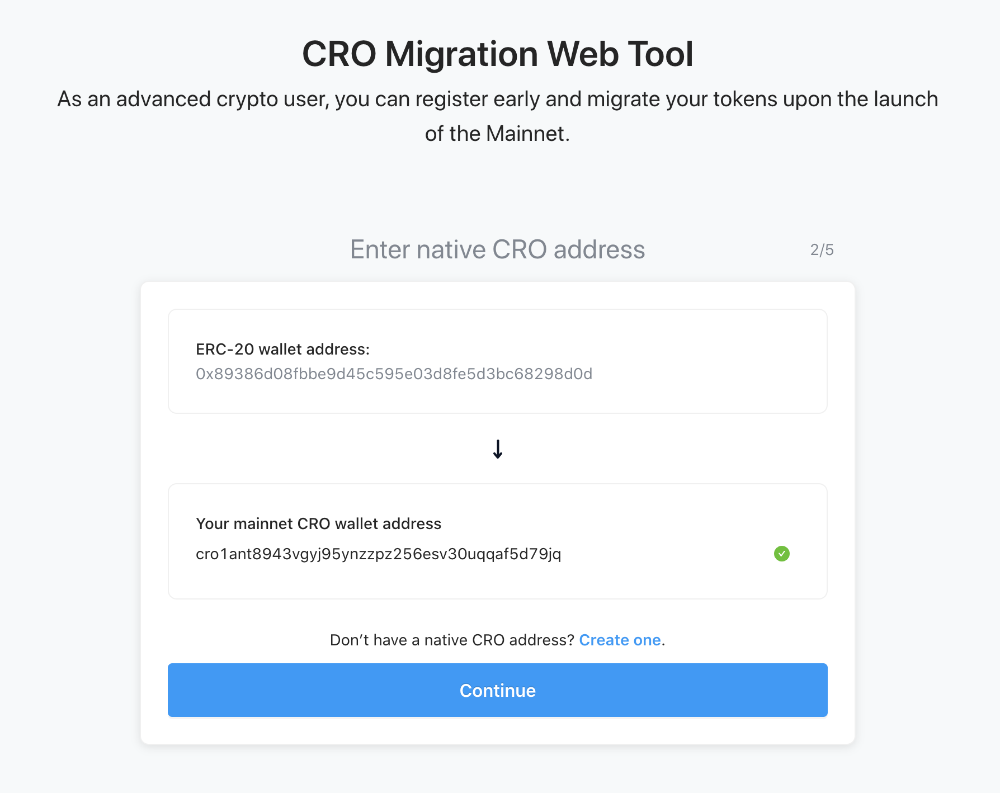<figcaption></figcaption></figure>

### 4. Fill in The Migration Amount

Fill in the amount of CRO you want to migrate to Mainnet and click "Continue".

<figure>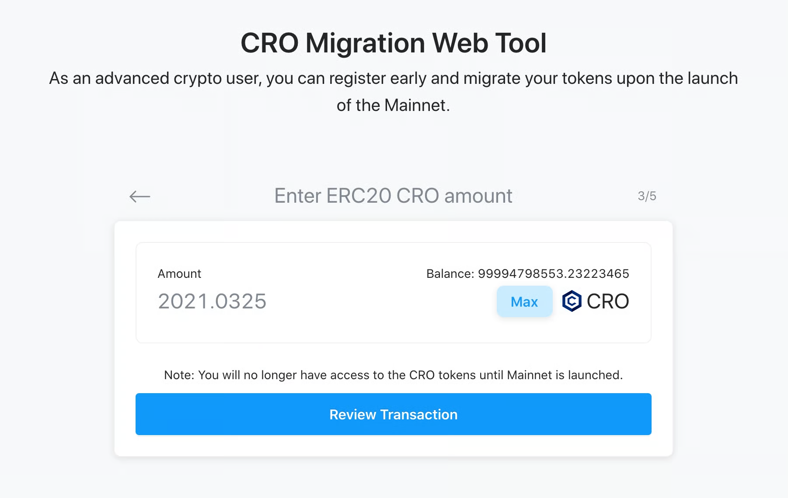<figcaption></figcaption></figure>

### 5. Review Your Migration

Review and confirm the details of your token migration request. Make sure all the information is correct.

Afterwards, read the "CRO Token Migration Terms". If you understand and agree to the terms, you can tick the checkbox and click "Sign Agreement".

<figure>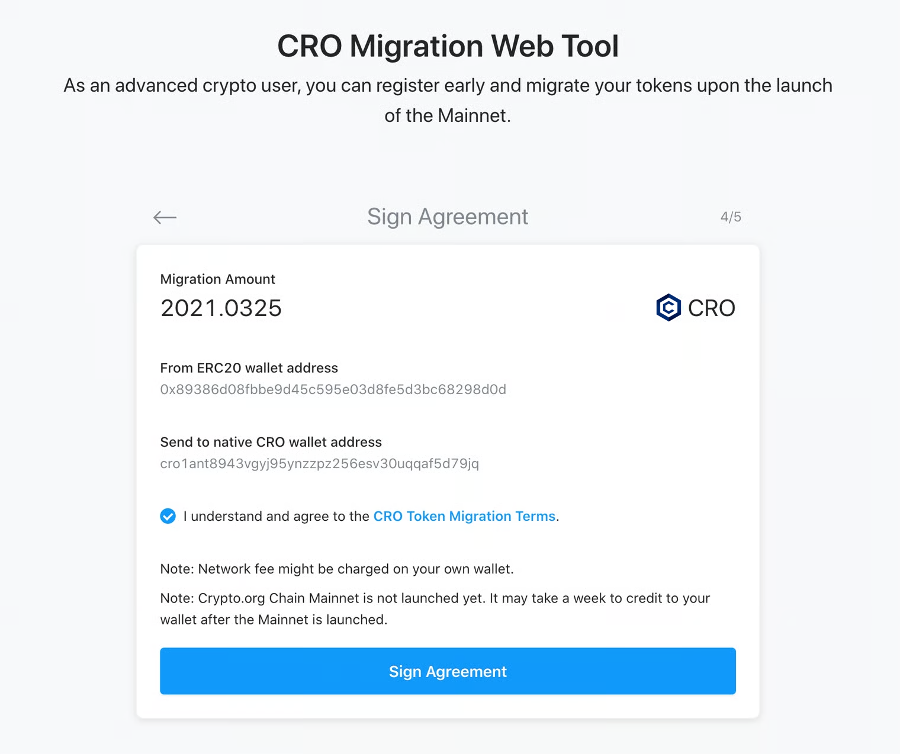<figcaption></figcaption></figure>

### 6. Sign The Agreement

A MetaMask popup will appear and ask for your signature. By signing this message with your MetaMask account, you acknowledge that you agree to the "CRO Token Migration Terms".

<figure>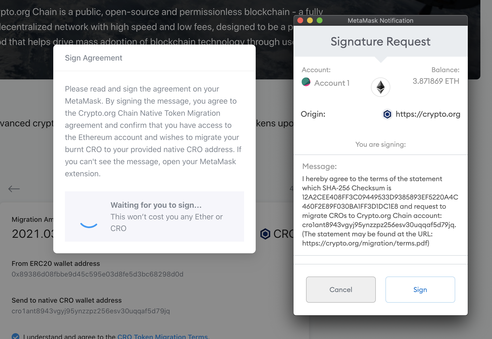<figcaption></figcaption></figure>

### 7. Sign The Burn Transaction

A MetaMask popup will appear and ask for your confirmation to send your ERC20 CRO to the [burn address](https://etherscan.io/address/0x000000000000000000000000000000000000dEaD) (0x000000000000000000000000000000000000dEaD). Please make sure all the information on this popup is correct before clicking "Confirm". In addition, you may adjust the gas parameters of your choice.

<figure>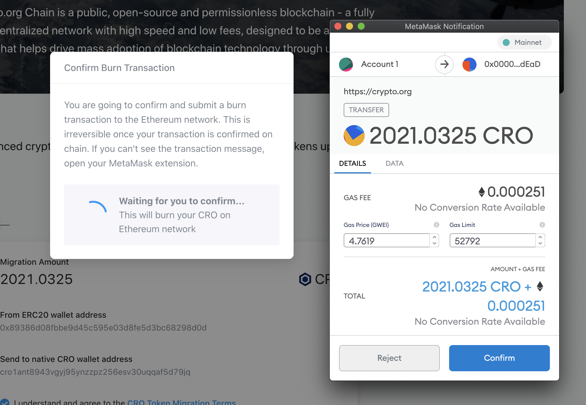<figcaption></figcaption></figure>


**Could Not See MetaMask Popup?**&#x20;

If you cannot see the MetaMask popups, you can check the MetaMask browser icon in your top right-hand corner. You should see a pending action on the icon and you can click the icon to continue the operations on MetaMask.


<figure>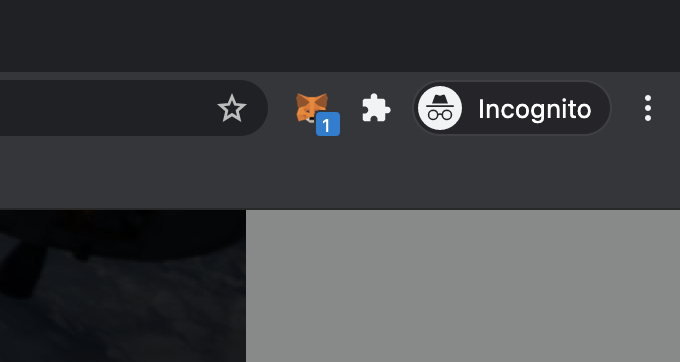<figcaption></figcaption></figure>

### 8. Successful Submission

If your migration request is submitted, you will see the following page.

<figure>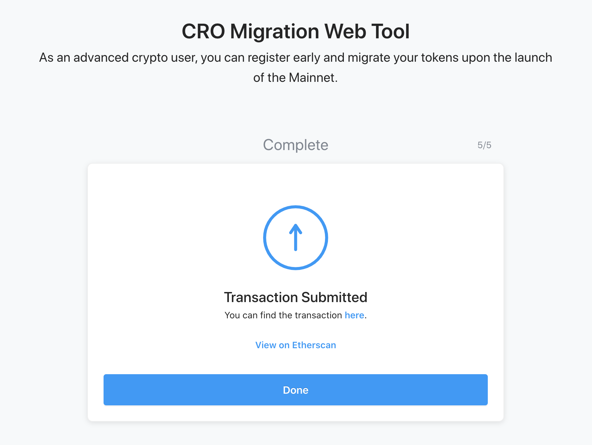<figcaption></figcaption></figure>


Failed To Submit Your Migration Request? You can always re-submit your token migration request if your burn transaction has already been confirmed and succeeded on the chain. For details, please refer to the [Re-submit Migration Request guide](token-migration.md#re-submit-migration-request)


### 9. Check Migration Record Status

To check for the latest status of your migration requests, click the "Migration Records" on the navigation bar or go to the [link](https://crypto.org/migration/tx).

You will see a list of migration requests associated with your current account and the status of it. If you are uncertain of the status, you can put your mouse over the status for an explanation.

<figure>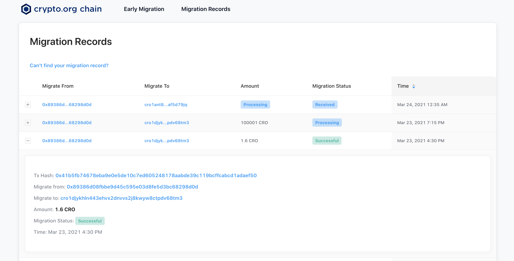<figcaption></figcaption></figure>

## Re-submit Migration Request

If you encountered an error during the registration, but have already burnt your CRO. You can use the [Migration Re-submission Tool](https://crypto.org/migration/resubmit) to re-submit your migration request.

### Pre-requisite

To use the re-submission tool, make sure:

* Your ERC20 CRO burn request is confirmed and succeeded on the Ethereum network
* The burn ERC20 CRO belongs to your current MetaMask account

### 1. Make Sure Your Migration Request Is Not Submitted

To do so, you can check the record on the [Migration Records Status Page](https://crypto.org/migration/tx). If you do not see your migration request appear on the list, it means your request has not been submitted.

### 2. Open Re-submission Tool

Go to [Token Migration Re-submission Tool](https://crypto.org/migration/resubmit).

Alternatively, you can go to [Token Migration website](https://crypto.org/migration) and click "Open Web Tool", you will see a text saying "Proceed to Re-submit Tool.".

<figure><figcaption></figcaption></figure>

### 3 Click "Connect Now" and choose "MetaMask" on the wallet list

<figure>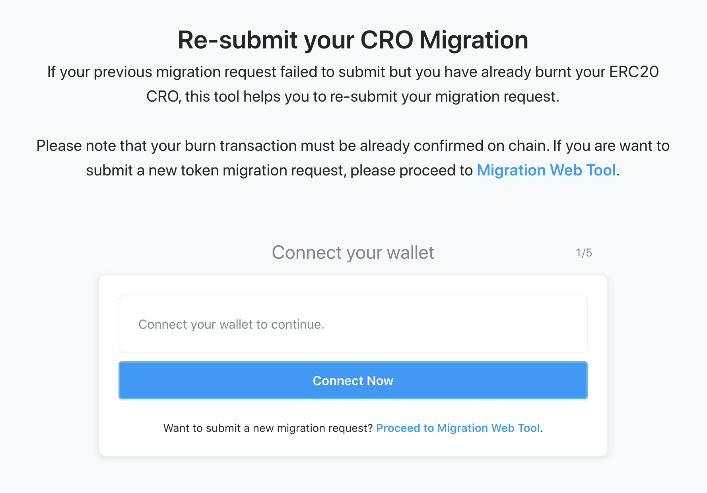<figcaption></figcaption></figure>

### 4. Fill in Your Mainnet Address


How to Generate Mainnet Address&#x20;

To generate a mainnet address, please refer to the [mainnet address generation guide](../docs/wallets/mainnet-address-generation.md)


Fill in the mainnet address you want to receive the migrated CRO. If the address is valid, you will see a green tick next to the address. After you have completed, click "Continue".

<figure>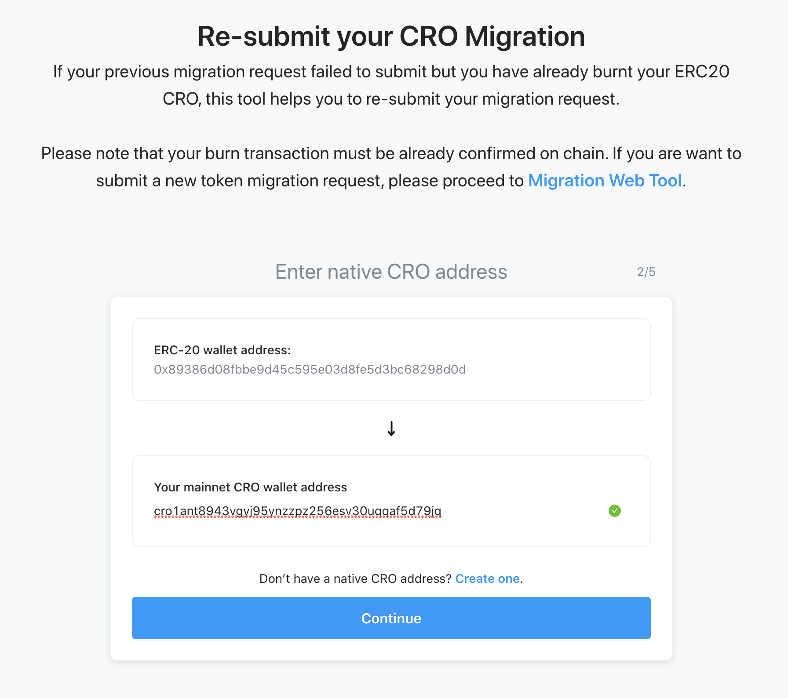<figcaption></figcaption></figure>

### 5. Fill in Your ERC20 CRO Burn Transaction Hash

Fill in your previous ERC20 CRO burn transaction hash and click "Review Transaction".

You can look for the burn transaction hash from your MetaMask transaction lists (Under the Activity tab).

<figure>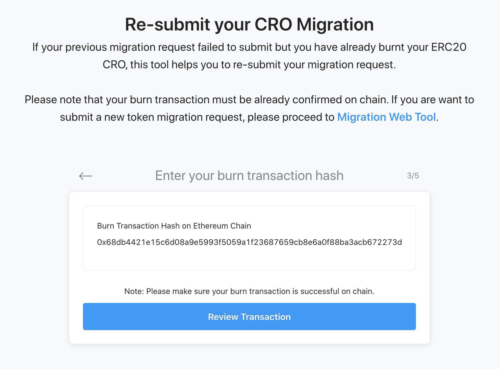<figcaption></figcaption></figure>

### 6. Review Your Burn Transaction

Review and confirm the details of your token migration request. Make sure all the information is correct.

Afterwards, read the "CRO Token Migration Terms". If you understand and agree to the terms, you can tick the checkbox and click "Sign Agreement".

<figure>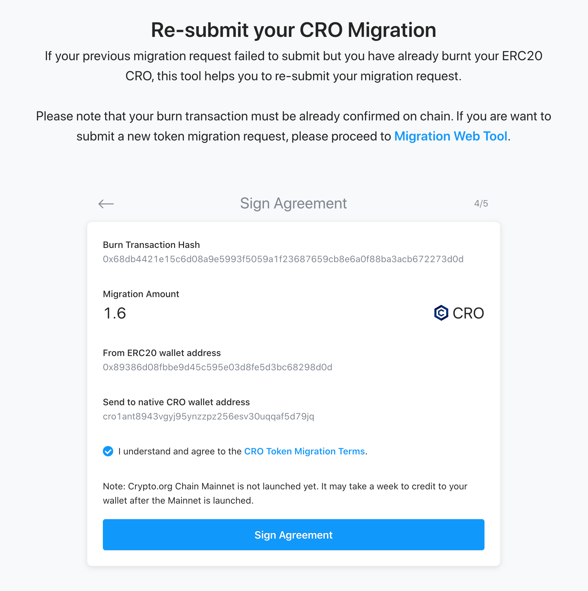<figcaption></figcaption></figure>

### 7. Sign The Agreement

A MetaMask popup will appear and ask for your signature. By signing this message with your MetaMask account, you acknowledge that you agree to the "CRO Token Migration Terms".

<figure><figcaption></figcaption></figure>


**Could Not See MetaMask Popup?**&#x20;

If you cannot see the MetaMask popups, you can check the MetaMask browser icon on the top right-hand corner. You should see a pending action on the icon and you can click the icon to continue the operations on MetaMask. &#x20;


<figure><figcaption></figcaption></figure>

### 8. Successful Submission

If you migration request is submitted, you will see the following page.

<figure><figcaption></figcaption></figure>


Failed To Submit Your Migration Request? You can always re-submit your token migration request if your burn transaction has already been confirmed and succeeded on the chain. For details, please refer to the [Re-submit Migration Request guide](token-migration.md#re-submit-migration-request)&#x20;


### 9. Check Migration Record Status

To check for the latest status of your migration requests, click the "Migration Records" on the navigation bar or go to the [link](https://crypto.org/migration/tx).

You will see a list of migration requests associated with your current account and the status of it. If you are uncertain of the status, you can put your mouse over the status for an explanation.

<figure><figcaption></figcaption></figure>
