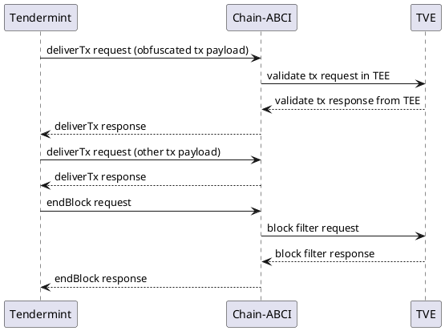
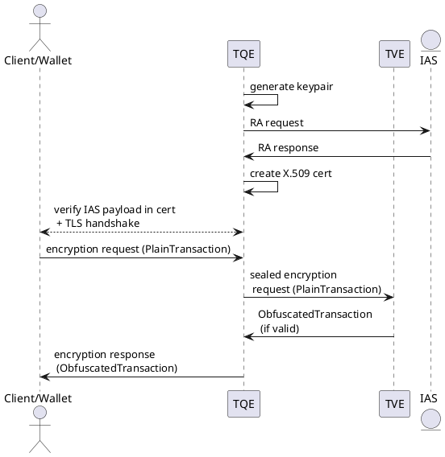
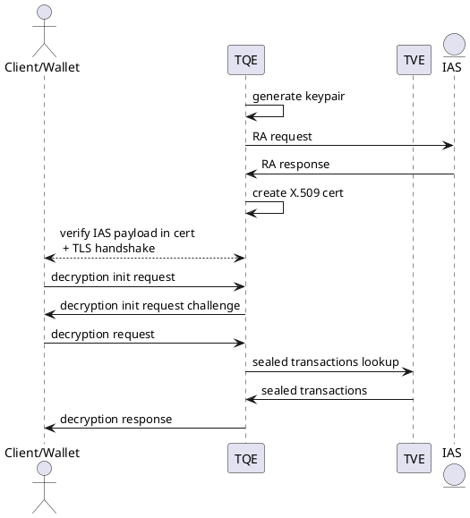
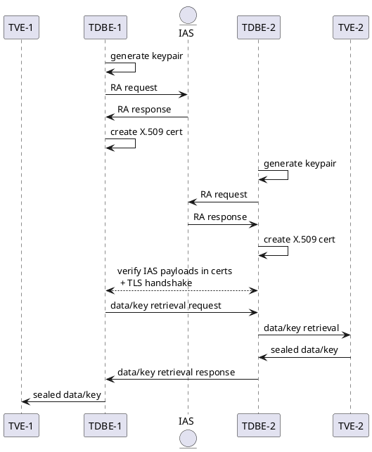

# Implementation Plan: TEE-enforced Transaction Data Confidentiality
## Abstract
This document describes the initial implementation plan of transaction data confidentiality for Crypto.com Chain.
The document tries to be as self-contained as possible.
The mechanism leverages Trusted Execution Environments (TEE) -- the initial implementation uses Intel SGX. A detailed description of Intel SGX can be found in [Intel SGX Explained by Costan and Devadas](https://eprint.iacr.org/2016/086.pdf).
The work in progress implementation can be found in the [chain-tx-enclave directory in the main Github repository](https://github.com/crypto-com/chain/tree/master/chain-tx-enclave).

## Motivation
Payment data need confidentiality for many reasons, including compliance with different privacy regulations, fungibility properties etc. While confidentiality can be achieved through different means, Crypto.com Chain leverages Trusted Execution Environments for three main reasons:

* *Flexibility* in terms of what computation can be done and how the data schema can evolve. 
As requirements for Crypto.com Chain change, it's important that the existing code and data remain
forwards-compatible. For example, one may extend the transaction format to support new signature schemes.

* *Auditability with potentially fine-grained access control mechanisms*:
in the initial implementation, it's a separation of the permission to spend and the permission
to view transaction data, but it could be more flexible and fine-grained (e.g. 
permission to view certain parts of transaction data).

* *Performance due to a low overhead*: unlike, for example, fully homomorphic encryption in software,
the overhead of executing computation in TEE should be minimal 
and the main cryptographic primitive is symmetric encryption which can be accelerated 
by dedicated CPU instructions, such as AES-NI.

## Background
### Crypto.com Chain Basic Background
Crypto.com Chain contains many parts, the more complete documentation can be found 
on the [technical documentation website](https://chain.crypto.com/docs/).

We summarize the basic background here:

* In the context of this document, TEE breaches would reduce confidentiality (there would still be a level of confidentiality, as only limited information is being broadcasted), but they would not lead to the loss of ledger integrity. For ledger integrity, Crypto.com Chain relies on Tendermint Core as its consensus algorithm.
* Light clients (needed in enclaves for keeping track of validators) are expected to follow [the Tendermint light client](https://github.com/tendermint/spec/tree/master/spec/consensus/light-client).
* Binary serialization is using the [Simple Concatenated Aggregate Little-Endian (SCALE) codec, defined in Section B.1 of Polkadot Host Protocol Specification](https://github.com/w3f/polkadot-spec/blob/master/host-spec/polkadot-host-spec.pdf).
* Crypto.com Chain uses a hybrid transaction accounting model with different transaction types.
For the purpose of simplifying discussion in this implementation plan, we will only consider this simplified UTXO-style transaction format:

```
PlainTransaction := (Tx, [Witness])
Tx := ([TxoPointer], TxMeta, [TxOut])
Witness := (secp256k1_public_key, merkle_path, schnorr_signature)
TxoPointer := (TxId, index)
TxMeta := (network_id_byte, ViewKeys)
ViewKeys := [secp256k1_public_key]
TxOut := (Address, Amount)
Address := merkle root / blake2_hash
Amount := (0; max_supply]
TxId := blake2_hash(scale_enc(Tx))
```

* `PlainTransaction` is valid if it satisfies the transaction validation rules (the sum of inputs and outputs matches / no new coins are created, all inputs are unspent, the witness matches each input and the signature is valid etc.).

* View keys are inserted into a probabilistic filter that's published for each block of transactions -- initially this probabilistic filter is the Bloom filter used in Ethereum defined with the following parameters: m = 2048 (bits; keccak-256 hash function), k = 3 (yellowpaper page 5)

* The above sketched out `PlainTransaction` will not be broadcasted on the network directly and in that plain raw form, it will only be accessible inside TEE. The data that will be broadcasted is be of the form:

```
ObfuscatedTransaction := (KeyID, IV, CipherText, TxId, [TxoPointer])
```

Where `KeyId` refers to the block number when it was created by the designated group of enclaves.
`IV` or nonce is the initialization vector.
`CipherText` is a result of AEAD encryption of SCALE-encoded payload of `PlainTransaction`;
`TxId` is passed as header / associated data.
As there are multiple untrusted writers / encryptors using the same key on the network,
the algorithm for AEAD encryption/decryption must be nonce misuse-resistant.
The initial implementation uses AES-GCM-SIV (but other schemes with similar properties, e.g. Deoxys-II v1.43, could potentially be used).


### TEE Primitives
This section contains a high-level / simplified overview of main TEE primitives utilized in this implementation plan.

#### Sealing
Enclaves typically do not have a persistent storage, so rely on its (untrusted) host to persist data. As data is persisted outside of TEE, it needs to be encrypted, such that the host cannot read it and data can later be unsealed in TEE. In SGX, there's an instruction for retrieving a sealing key (EGETKEY) that can later be used in authenticated encryption. One can decide whether the sealing key binds to the current enclave application version ("sealing to MRENCLAVE") or to the enclave application's author ("sealing to MRSIGNER"). In the latter sealing policy, enclave application upgrades are possible -- SGX enforces that enclave application can derive sealing keys of applications that have the same ProductID (and are signed by the same production key) and the same or lower TCB Security Version Numbers. So, a new enclave application version can unseal data sealed by its old version, but the old version cannot unseal data sealed by the new version.

#### Remote Attestation
This is a process of establishing trust when working with an enclave not on a local machine. In SGX, this process goes in several steps: 

  1) the enclave application produces a data structure that contains various metadata, CPU measurements and a custom data payload (64 bytes) and calls the quoting enclave provided in Intel SDK;
  
  2) the quoting enclave verifies this data structure and signs it (this payload can be used for local attestation);
  
  3) the signed data structure is then sent to the Intel Attestation Service (IAS; a web service) that carries out a verification of this signed data structure -- in its response, it returns whether it's OK or something is wrong (execution in SW emulation mode, execution on HW with vulnerable CPU microcode etc.).
  
The IAS response is returned to the counter-party that tries establishing the communication with the enclave -- the counter-party checks the response's metadata (correct enclave application, ok response) and that the signature corresponds to the IAS certificate. Typically, this is used in combination with TLS or other secure channel communication protocols: e.g. the enclave generates its keypair, puts the public key (or its hash) into the payload used in the attestation process; the counter-party then (after verifying the IAS signed data) uses the provided/attested public key in establishing a TLS session.

## Enclave Infrastructure Overview
There are three enclaves planned in Crypto.com Chain's transaction data confidentiality implementation:

* *transaction validation enclave* (TVE) responsible for 
1) validating transactions,
2) persisting previously valid transactions (sealed to a local machine),
3) holding the current key (used for obfuscating or de-obfuscating transaction data).

* *transaction query enclave* (TQE) responsible for serving encryption and decryption requests
from wallets / clients.

* *transaction data bootstrapping enclave* (TDBE): responsible for current UTXO set transaction data fetching and periodic key generation operations.

### Transaction Validation Enclave (TVE)
The current consensus engine "calls" Crypto.com Chain's application code at different stages:

1) when a transaction payload enters the mempool (either from the client's request or from the P2P broadcast);
2) during consensus rounds when transactions are selected for the block.

(For more details, see the [ABCI specification](https://docs.tendermint.com/master/introduction/what-is-tendermint.html#abci-overview).)

On the high level, the consensus engine passes transaction payloads 
(which it is agnostic to) down to the application code and the application code returns
whether the transaction is valid or not. If the transaction payload is `ObfuscatedTransaction`, the application code
relays this transaction payload to the transaction validation enclave that determines whether it is valid or not.
The flow is as follows:

1) transaction payload is obtained from the consensus engine and parsed;
2) a simple check is performed on the parsed payload (in this case, that all specified inputs are unspent);
3) if OK, transaction payload is sent via a local messaging socket to the transaction validation enclave wrapper;
4) the enclave wrapper parses the payload, looks up sealed transaction inputs in its local database and passes all information in the enclave call,
4) the enclave function attempts to decrypt the payload with the key in its memory (details how this key is generated are in the TDBE section below), unseal the transaction inputs and parse + validate the payload
(checking amounts, signatures etc.),
5) if the transaction is valid, the enclave inserts the transaction view keys into the probabilistic filter in memory, and seals the
transaction -- the enclave wrapper then persists the sealed transaction in its local database.



Once the consensus engine signals the end of the block, the application code requests the enclave to return the probabilistic filter -- the enclave returns and clears the filter, the application code then publishes this filter as an additional block metadata ("events" in the Tendermint terminology).

### Transaction Query Enclave (TQE, optional / for client infrastructure)
Running the transaction query enclave is optional, as it serves client/wallet code that may not be executed on SGX hardware.

The transaction query enclave wrapper listens on a TCP port -- when a client connects, they undergo the TLS handshake (the current 
code uses 1.2, but it's planned to upgrade to 1.3):

0) (the enclave generates a P-256 keypair and puts the public key in the IAS request payload -- see the Remote Attestation section)
1) in the enclave X.509 certificate, the IAS response payload is included as V3 Extension,
2) the client knows the IAS certificate chain -- 
when establishing the TLS session, the client has an extra code to verify the IAS response in the enclave certificate extension
(that it's OK and signed by IAS, enclave code measurement matches, the enclave author is Crypto.com etc.),
3) after establishing the TLS session, the client sends either an encryption or decryption request.

#### Basic Client Flows
There are two flows that clients execute against the transaction query enclave.

##### Encryption
1) after establishing the TLS session, the client submits `PlainTransaction` in a request
2) transaction query enclave seals that request and relays it to the transaction validation enclave
3) transaction validation enclave wrapper looks up the request inputs and passes them together with the request to the transaction validation enclave function
4) transaction validation enclave unseals the request and inputs, validates the transaction in the request -- if valid, it'll encrypt it with the
current key
5) the encrypted transaction is returned from the transaction validation enclave to the tx query enclave and then to the client



##### Decryption
This flow is in a sense optional
-- it is to support asynchronous flows where the token sender does not contact the token receiver directly (the alternative is that the sender sends `PlainTransaction` to the receiver directly),
but knows the receiver's view key. The receiver runs a client to monitor new blocks.

The client runs the light client protocol that it keeps track of the validator set and blocks:
it checks the probabilistic filters in non-empty blocks and takes note of their transactions (i.e. transaction identifiers, as the content is obfuscated) if the filter matches one of its public view keys.

1) after establishing the TLS session, the client starts a decryption request
2) the query enclave returns a random 32-byte payload
3) the client constructs and sends a decryption request: it includes the transaction IDs (+ possibly random transaction IDs) from the blocks that matched one of the public view key + the public view key + the random payload + ECDSA signature with the corresponding private view key.
4) the query enclave verifies that the request contains the expected random payload + that the signature is valid.
5) if valid, the query enclave then sends a request to the transaction validation enclave to look up the transaction IDs
6) the transaction validation enclave sends back the sealed transactions
7) the query enclave unseals transactions and checks if any of them contain the public view key from the request
8) the query enclave returns the matching transactions back to the client




### Transaction Data Bootstrapping Enclave (TDBE)
The transaction data bootstrapping enclave help with two use cases:

1) all nodes: retrieval of historical data (unspent transaction inputs) + current key to obfuscate transaction data
2) validator nodes: generation of the shared key used to obfuscate transaction data.

#### Data/Key Retrieval: Enclave-to-Enclave Communication
Each node's transaction data bootstrapping enclave may optionally open a port to listen on for data/key retrieval requests.
The communication is similar to the one described in the transaction query enclave (TLS + enclave attestation), but is bi-directional:

* if transaction data is to be requested: before establishing the connection, the missing data is computed outside of the enclave using a light client + [utreexo](https://dci.mit.edu/utreexo) (Merkle forest commitments to the UTXO set). The transaction IDs to be retrieved are passed to the transaction data bootstrapping enclave
* the requesting TDBE presents the client-side X.509 certificate with the IAS response payload in the v3 extension -- the responding TDBE verifies its content (response is OK and signed by IAS, the code is the same as the one it is executing, etc.) and vice versa.

1) after establishing the TLS session, the requesting TDBE either sends a key retrieval or a data retrieval request
2) the responding TDBE relays this request to its transaction validation enclave that returns a response (sealed for the responding TDBE)
3) the responding TDBE unseals and sends back the response to the requesting TDBE
4) the requesting TDBE seals the response and passes it to its transaction validation enclave
5) the transaction validation enclave verifies the response: for the key, it verifies signatures of all participating validators on the payloads to generate the key from (and that
they are indeed correct validators) and seals it in its memory; for the data, it runs a basic validation, seals each transaction and lets its wrapper to persist it in the local database. 





#### Key Generation and Rotation
The key that is used to obfuscate broadcasted transaction payloads is periodically generated by the current set of validators.
Besides the token stake, each validator (referred to as a council node)
publishes its associated metadata -- either in the genesis file (which contains the init message), or in the public transaction payload used to join the network.
The metadata contains its UserInitKey / communication public key (corresponding to a dedicate private key generated inside the transaction data bootstrapping enclave) with IAS payload which nodes verify before establishing the group communication channel
among validators. The protocol for the group communication channel follows the [the proposed Messaging Layer Security (MLS) Protocol](https://protocol.messaginglayersecurity.rocks).

* Each validator's transaction data bootstrapping enclave retrieves the identities of other validators,
* Based on the validator identities (sorted by the validator staking address), each validator's transaction data bootstrapping enclave
initializes GroupContext (constructs a ratchet tree with its leaves populated with the public keys and credentials from the UserInitKeys etc.)
* If a validator is removed or added, the corresponding MLS handshake messages are generated and broadcasted as transactions using Tendermint P2P
-- transaction validation enclave either only checks the outer signature (in the case of non-validator nodes) or relays it to the transaction 
data bootstrapping enclave (in the case of validator nodes) where the node fully checks the messages and updates its group state
* Once group communication channel is established or whenever the group state changes, the key for transaction data obfuscation is re-generated.
The generation process is the following:

1) each validator's transaction data bootstrapping enclave generates a random 32-bit payload (RRAND/RDSEED) and broadcasts a transaction with Application Message 
(encrypted to the validator group; again broadcasted as Tendermint transactions with the above logic) with a hash-commitment to that payload
2) after more than 2/3 of commitments arrive, each validator's transaction data bootstrapping enclave creates Application Message that reveals the payload to the group (with a dedicated signature for external verification)
3) once 2/3 payloads (in the commitment order) reach the validator's transaction data bootstrapping enclaves, the new key is established
by forwarding these payloads with signatures to the transaction validation enclaves.
4) each transaction validation enclave checks the signatures against the current set of validators and if all correct, it uses the payloads as a seed to HC-128 -- it temporarily keeps the existing key (if any) during the grace period and replaces it with the new key obtained as the output of HC-128.

The newly generated keys are then spread to other enclaves using the enclave-to-enclave communication described in the previous section.

## Future Work / Known Limitations
Currently, there are two main known limitations of the initial planned implementation.

### Reliance on the Intel infrastructure
This limitation will be addressed in two ways in the future:
- SGX v2 allows "Flexible Launch Control" and IAS can be replaced by an infrastructure operated by validators themselves (SGX Data Center Attestation Primitives / DCAP)
- When commercial RISC-V CPUs with [Keystone](https://keystone-enclave.org) support are ready, the code could be extended to handle cross-architecture attestation and be more robust in terms of supported hardware manufacturers

### Too much burden on the light client / wallet implementation
The additional burden is from the following facts:

1) As view keys are inserted into public probabilistic filters, the client code is responsible for maintaining, watching and rotating view keys.

2) As clients request transaction data from remote nodes, even though the actual data is in TEE and secure channels, the node operator may
observe the I/O (what transaction IDs are looked up, how much traffic is being exchanged etc.) -- the client code is responsible for requesting from different nodes as well as introducing some noise in the requests (e.g. requesting extra arbitrary transactions).

To address this limitation, the future implementation of full nodes will be enhanced with 
the capability of privacy-preserving view-key indexing -- instead of client keeping track of potentially relevant transactions through the use of probabilistic filters, it can directly request all relevant transactions
from the full node. To prevent disclosing what transactions belong to which view key, the view key index storage
will be ORAM-based (similarly to [ZLiTE](https://eprint.iacr.org/2018/1024.pdf)).
